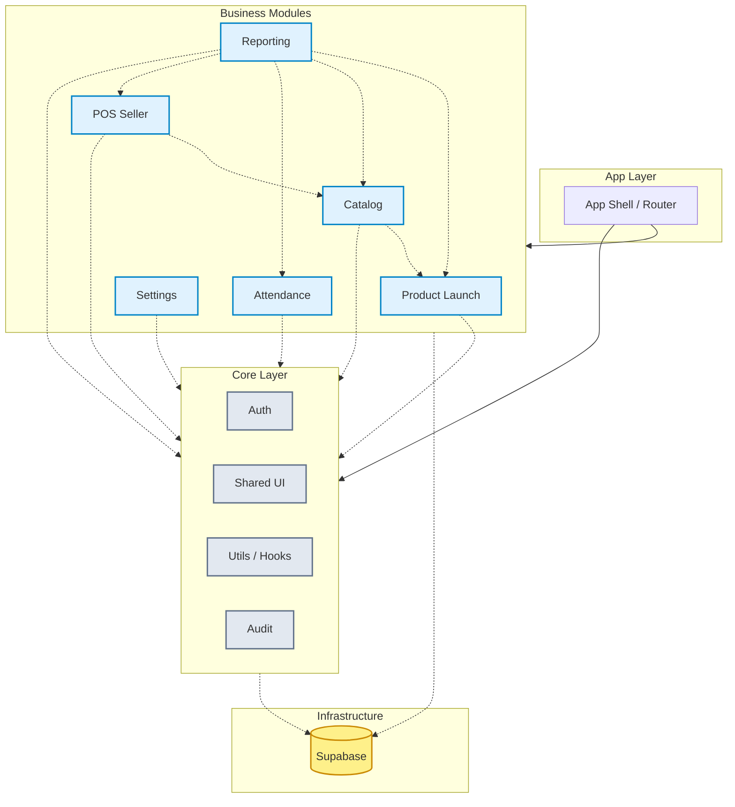
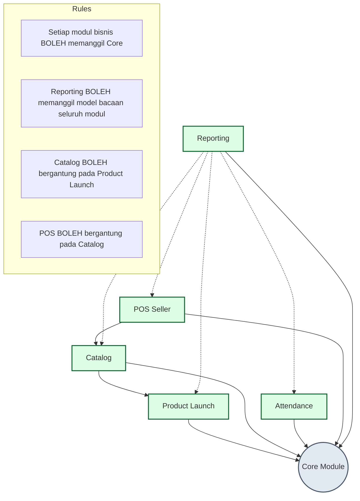
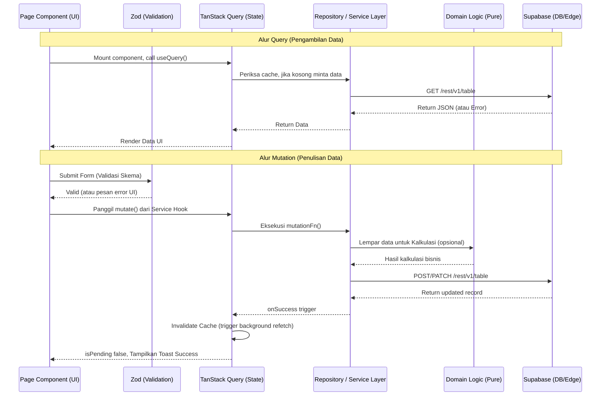

# Arsitektur Sistem GG Product OS

## 1. Deskripsi Arsitektur Sistem
GG Product OS adalah aplikasi mandiri (greenfield) yang dirancang khusus untuk mengelola seluruh *workflow* pengembangan dan peluncuran (*launching*) artikel produk untuk merek fesyen GG Supply dan GUDSKUY. Aplikasi ini dirancang terpisah secara fungsional dan teknis dari GarSys Pro, berfokus murni pada lifecycle produk dari tahap ideasi (Work Order) hingga masuk ke dalam katalog produk yang siap jual.

Arsitektur aplikasi ini menggunakan pendekatan **Modular Monolith** pada sisi frontend (Single Page Application - SPA). Semua fitur berada dalam satu repositori (*codebase*), namun dipisahkan dengan batasan (*boundaries*) modul yang sangat tegas. Hal ini memastikan bahwa seiring bertambah kompleksnya aplikasi, kode tetap dapat dipertahankan (*maintainable*), mudah di-test, dan meminimalisir efek samping (*side effects*) ketika terjadi perubahan di salah satu fitur.

Lapisan backend dan database di-handle sepenuhnya oleh **Supabase**, menggunakan pendekatan *Backend-as-a-Service* (BaaS). Logika keamanan utama ditempatkan pada lapisan *Row Level Security* (RLS) di database PostgreSQL Supabase, sementara *Edge Functions* digunakan untuk logika bisnis khusus yang tidak bisa (atau tidak aman) ditangani secara langsung di sisi *client*.

## 2. Technology Decision Record (TDR)

Setiap keputusan teknologi yang digunakan di dalam GG Product OS dipilih dengan pertimbangan performa, *developer experience* (DX), dan ekosistem pendukung jangka panjang.

| Teknologi | Pilihan | Alasan Pemilihan |
|---|---|---|
| **Frontend Core** | React 18 + TypeScript | Ekosistem terbesar, dukungan *concurrent rendering* di React 18. TypeScript digunakan untuk *type safety* secara ketat yang akan mengurangi bug *runtime* secara signifikan dalam aplikasi berskala besar. |
| **Build Tool** | Vite 5 | Waktu *startup* pengembangan (HMR) yang sangat cepat dibandingkan Webpack, menggunakan arsitektur ESM native, serta proses *build production* berbasis Rollup yang efisien. |
| **Router** | React Router v6 | Standar industri untuk SPA React, mendukung konfigurasi *nested routing*, *data loading*, dan *lazy loading* berbasis modul untuk *code splitting* yang optimal. |
| **Server State** | TanStack Query v5 | Menyediakan mekanisme *caching*, *deduplication*, sinkronisasi *background*, *optimistic updates*, dan penanganan *retry* otomatis. Memisahkan antara state UI (*client state*) dengan state dari database (*server state*). |
| **Form Handling** | React Hook Form v7 | Sangat *performant* karena mengurangi re-render pada setiap ketikan *input*. API yang mudah dikombinasikan dengan resolver eksternal. |
| **Validation** | Zod v3 | Skema validasi *schema-first* yang berjalan sempurna dengan TypeScript, mendukung validasi berlapis dan pesan error yang *customizable*. Terintegrasi mulus dengan React Hook Form. |
| **Backend / Auth** | Supabase JS v2 | Solusi *Backend-as-a-Service* lengkap. Menyediakan Autentikasi yang solid, SDK untuk manipulasi data *real-time* atau *REST-based* langsung ke PostgreSQL, penyimpanan (*storage*), dan *Edge Functions*. |
| **Styling** | Tailwind CSS v3 | *Utility-first CSS framework* yang meminimalisir pembengkakan file CSS, desain sistem yang mudah di-kustomisasi, mempercepat pembuatan UI (*styling*), dan bekerja sangat baik di dalam ekosistem React. |
| **Testing** | Vitest + React Testing Library + Playwright | Vitest memiliki API identik dengan Jest namun berjalan di atas Vite (lebih cepat). RTL untuk *unit/integration test* komponen. Playwright untuk *End-to-End* (E2E) test mencakup navigasi *browser* secara riil. |
| **Lint / Format** | ESLint + Prettier | Menjaga konsistensi kode dan secara otomatis menangkap pola kode yang bermasalah sejak fase penulisan kode. |

## 3. Module Boundaries Diagram

Modul pada GG Product OS dipisahkan berdasarkan domain fungsional bisnisnya. `Core` berisi *shared-kernel*, sedangkan modul lainnya bersifat spesifik.



## 4. Struktur Folder Lengkap dan Penjelasan

Aplikasi mengikuti arsitektur berorientasi fitur/domain.

```text
src/
  app/                    # Layer paling atas (Entry point & konfigurasi utama)
    router/               # Definisi route utama, lazy loading module config
    providers/            # Global context providers (QueryClient, AuthProvider, Theme)
    guards/               # Route guards (AuthGuard, PermissionGuard, FeatureGuard)
    layouts/              # Struktur layout halaman (Sidebar, Header, AppLayout)
    config/               # Variabel environment dan konstanta global aplikasi
  core/                   # Shared kernel (digunakan di semua module bisnis)
    auth/                 # Logika autentikasi dan session management
    users/                # Domain core untuk pengguna
    roles/                # Domain core untuk roles pengguna
    permissions/          # Utilitas untuk pengecekan hak akses (RBAC)
    feature-flags/        # Sistem feature flag untuk menyalakan/mematikan modul
    media/                # Utilitas upload/download ke Supabase storage
    audit/                # Sistem logging untuk setiap aksi kritis (Audit Trail)
    ui/                   # Reusable UI components (Button, Modal, Table, dsb.)
    hooks/                # Global custom hooks (useWindowSize, useDebounce, dll)
    utils/                # Global helpers (date formatter, currency formatter)
    types/                # Global TypeScript definitions
  modules/                # Modul-modul bisnis aplikasi (Domain-driven)
    launch/               # Modul Product Launch (Work Order, HPP, QC, dll)
      domain/             # Entitas bisnis, tipe data spesifik modul, kalkulasi murni
      data/               # Repositori Supabase (queries & mutations spesifik modul)
      services/           # Logic transaksional, orkestrasi workflow, integrasi data layer
      components/         # Komponen UI yang HANYA digunakan di dalam modul ini
      pages/              # Komponen setingkat halaman untuk dirender oleh router
      routes/             # Definisi child-routes dari modul ini
      schemas/            # Zod validation schemas
      tests/              # Unit test dan integration test spesifik modul
    catalog/              # Modul Katalog (Produk jadi, Varian, Publikasi)
      [struktur sama]
    attendance/           # Modul Presensi (Saat ini Feature Flag = OFF)
      [struktur sama]
    pos/                  # Modul POS Seller (Saat ini Feature Flag = OFF)
      [struktur sama]
    reporting/            # Modul Laporan lintas fungsional (Read-only cross-module)
    settings/             # Modul Pengaturan sistem, perusahaan, master data dasar
  integrations/           # Adaptor untuk layanan eksternal
    supabase/             # Instansiasi client Supabase (createClient)
    media/                # Integrasi third-party media jika bukan Supabase
    printing/             # Integrasi thermal printer / hardware lokal (jika ada)
  styles/                 # Konfigurasi Tailwind, CSS global
  test/                   # Konfigurasi testing global, mock, setup files
docs/                     # Dokumentasi proyek (Arsitektur, Panduan, ADR)
public/                   # Static assets (logo, favicon, manifest)
supabase/                 # Konfigurasi backend Supabase lokal (Supabase CLI)
  migrations/             # Skema SQL, tabel, RLS, Triggers
  seed/                   # Data awal (roles, default admin) untuk development
  functions/              # Edge Functions code (Deno/TypeScript)
```

## 5. Dependency Map Antar Module

Aturan dependensi ini menjaga agar modul tidak *tightly-coupled* secara tidak terprediksi (menghindari *spaghetti code*).



**Aturan Ketat (Dilarang):**
- Modul `Core` **dilarang keras** mengimpor dari folder `modules/*`. Core bersifat *agnostic* terhadap logika bisnis aplikasi.
- `Product Launch` **dilarang** mengimpor dari `POS` atau `Attendance`.
- `Attendance` **dilarang** mengimpor dari `POS`.

## 6. Routing Architecture dengan Lazy Loading

Aplikasi menggunakan React Router v6. Untuk memastikan bundle size awal tetap kecil, sistem modul di-*lazy load*. Saat pengguna login pertama kali, browser hanya mendownload `Core` dan layout halaman. File modul `Catalog` hanya didownload ketika pengguna mengklik menu Katalog.

### Struktur Route
```text
/login                                -> Halaman Autentikasi
/onboarding                           -> Halaman setup awal perusahaan/pengguna baru
/app                                  -> AppLayout (Membutuhkan AuthGuard)
  /dashboard                          -> Dashboard (Overview)
  
  // Modul Launch (Lazy Loaded)
  /launch/work-orders                 -> Daftar WO
  /launch/work-orders/new             -> Buat WO Baru
  /launch/work-orders/:id             -> Detail WO
  /launch/monitor                     -> Kanban/Monitoring status
  /launch/materials                   -> Master Material
  /launch/suppliers                   -> Master Supplier
  /launch/samples                     -> Pengelolaan Sample
  /launch/hpp                         -> Kalkulasi & Approval HPP
  /launch/size-charts                 -> Master Size Chart
  /launch/qc                          -> Quality Control Panel
  /launch/reports                     -> Laporan khusus Launch
  
  // Modul Catalog (Lazy Loaded)
  /catalog/products                   -> Daftar Produk Jual
  /catalog/products/:id               -> Detail Varian & Info Publikasi
  
  // Modul Attendance (Lazy Loaded & Dilindungi FeatureGuard)
  /attendance/today                   -> Presensi Hari Ini (Flag OFF)
  /attendance/team                    -> Presensi Tim (Flag OFF)
  /attendance/shifts                  -> Jadwal Shift (Flag OFF)
  /attendance/requests                -> Izin/Cuti/Koreksi (Flag OFF)
  /attendance/reports                 -> Laporan Presensi (Flag OFF)
  
  // Modul POS Seller (Lazy Loaded & Dilindungi FeatureGuard)
  /pos/sell                           -> Layar Kasir (Flag OFF)
  /pos/orders                         -> Riwayat Transaksi (Flag OFF)
  /pos/shifts                         -> Buka/Tutup Shift POS (Flag OFF)
  /pos/customers                      -> Database Pelanggan (Flag OFF)
  /pos/reports                        -> Laporan Penjualan POS (Flag OFF)
  
  // Modul Settings
  /settings/users                     -> Manajemen Pengguna
  /settings/roles                     -> RBAC & Roles
  /settings/permissions               -> Daftar Permission
  /settings/brands                    -> Master Brand (GG Supply / GUDSKUY)
  /settings/features                  -> Toggle Feature Flags internal
  /settings/company                   -> Profil Perusahaan
```

## 7. Repository dan Service Layer Pattern

**Prinsip Desain:**
UI Components (Pages/Views) **tidak boleh** memanggil *Supabase Client* secara langsung untuk melakukan modifikasi (Insert/Update/Delete). 
- **Repository:** Bertanggung jawab untuk mendefinisikan *Query* data (Fetching). Diimplementasikan dengan Custom Hooks pembungkus TanStack Query.
- **Service:** Bertanggung jawab untuk eksekusi logika mutasi (*Mutation*), pemrosesan *workflow* bisnis, validasi *domain*, dan pengiriman data ke backend.

### Contoh Pseudocode: Kalkulasi HPP di Modul Launch

**Domain Layer (`modules/launch/domain/hpp-calculator.ts`)**
Kalkulasi murni (pure function), mudah diuji (*unit testable*).
```typescript
export const calculateTotalHPP = (materials: MaterialCost[], laborCost: number): number => {
  const materialCost = materials.reduce((sum, item) => sum + (item.price * item.quantity), 0);
  return materialCost + laborCost;
};
```

**Repository Layer (`modules/launch/data/use-work-orders.ts`)**
Pengambilan data (*Fetching*).
```typescript
import { useQuery } from '@tanstack/react-query';
import { supabase } from '@/integrations/supabase/client';

export const useWorkOrderDetails = (id: string) => {
  return useQuery({
    queryKey: ['work-order', id],
    queryFn: async () => {
      const { data, error } = await supabase
        .from('work_orders')
        .select('*, materials(*)')
        .eq('id', id)
        .single();
        
      if (error) throw error;
      return data;
    }
  });
};
```

**Service Layer (`modules/launch/services/use-update-hpp.ts`)**
Eksekusi logika transaksional (*Mutation*).
```typescript
import { useMutation, useQueryClient } from '@tanstack/react-query';
import { supabase } from '@/integrations/supabase/client';
import { calculateTotalHPP } from '../domain/hpp-calculator';

export const useUpdateWorkOrderHPP = () => {
  const queryClient = useQueryClient();

  return useMutation({
    mutationFn: async ({ workOrderId, materials, laborCost }) => {
      // 1. Validasi / Kalkulasi di Domain
      const totalHPP = calculateTotalHPP(materials, laborCost);
      
      // 2. Transaksi ke Database via Supabase
      const { data, error } = await supabase
        .from('work_orders')
        .update({ hpp_calculated: totalHPP, status: 'HPP_REVIEW' })
        .eq('id', workOrderId)
        .select();
        
      if (error) throw new Error(error.message);
      
      // 3. Catat ke Audit Log
      await supabase.rpc('log_audit', { 
        action: 'UPDATE_HPP', 
        entity_id: workOrderId,
        details: { totalHPP }
      });
      
      return data;
    },
    onSuccess: (data, variables) => {
      // Invalidate cache TanStack Query agar UI langsung update
      queryClient.invalidateQueries({ queryKey: ['work-order', variables.workOrderId] });
    }
  });
};
```

**Page/UI Component (`modules/launch/pages/HppCalculationPage.tsx`)**
Tidak tahu menahu tentang Supabase. Hanya mengonsumsi hooks.
```tsx
export const HppCalculationPage = ({ workOrderId }) => {
  const { data: wo, isLoading } = useWorkOrderDetails(workOrderId);
  const { mutate: updateHPP, isPending } = useUpdateWorkOrderHPP();

  const handleSave = (formValues) => {
    updateHPP({ 
      workOrderId, 
      materials: formValues.materials, 
      laborCost: formValues.laborCost 
    });
  };

  if (isLoading) return <Spinner />;
  
  return <HppForm initialData={wo} onSubmit={handleSave} isSubmitting={isPending} />;
};
```

## 8. Query dan Mutation Flow

Diagram ini menunjukkan pemisahan antara alur pengambilan data dan modifikasi data.



## 9. Error Handling Strategy

Strategi komprehensif digunakan untuk menangani setiap jenis error secara spesifik:

1. **Network Errors (Koneksi Putus/Lambat):**
   - Di-handle secara transparan oleh **TanStack Query**.
   - Sistem akan melakukan *retry* otomatis dengan strategi *exponential backoff* (misal: coba lagi setelah 1 detik, lalu 3 detik, lalu 7 detik) sebelum menampilkan indikator *offline* atau gagal memuat data.
2. **Auth Errors (Token Expired / Invalid Session):**
   - *Axios interceptor* atau lapisan konfigurasi Supabase Client akan mendeteksi status `401 Unauthorized`.
   - Otomatis mereset *global state* Auth dan me-*redirect* user ke halaman `/login` dengan menyimpan state URL terakhir agar bisa dikembalikan setelah login ulang.
3. **Permission / Role Errors (403 Forbidden):**
   - Ketika *Row Level Security* (RLS) menolak *query* atau *Guard Component* mencegat akses ke *route*.
   - User akan dialihkan ke layar `PermissionDenied` component dengan keterangan *role* atau hak akses apa yang kurang, daripada hanya memunculkan layar putih atau error *crash*.
4. **Validation Errors (Input Form):**
   - Ditangani di level UI menggunakan **Zod** dan **React Hook Form**.
   - Input yang salah format (misalnya HPP minus, nama material kosong) tidak akan pernah sampai ke *Service Layer*. Error dirender di bawah masing-masing input *field* di layar (*inline errors*).
5. **Business Logic / Database Errors:**
   - Error yang dikembalikan oleh Supabase (misal: *unique constraint violation*, stok habis).
   - *Service Layer* menangkap error ini, memetakan pesan error teknis menjadi bahasa manusia/bisnis, dan menampilkannya sebagai *Toast Notification* atau pesan di dalam Form.
6. **Fatal Errors (Code Exception / Uncaught):**
   - Ditangkap oleh *React Error Boundary* di tingkat Root atau tingkat Modul. Menampilkan UI *fallback* elegan ("Terjadi kesalahan sistem") dan mencatat ke *Sentry* (untuk Production).

## 10. Logging Strategy

Logging sangat penting untuk jejak rekam operasional dan investigasi *bug*.

1. **Audit Logs (Business/Security Logging):**
   - Disimpan langsung di database (tabel `audit_logs`).
   - Sifat tabel ini adalah *Append-Only* (hanya bisa menambah data, RLS melarang penghapusan).
   - Menyimpan `user_id`, `action` (misal: "APPROVE_HPP"), `entity`, `entity_id`, dan `payload` (JSON perubahan).
   - Digunakan oleh modul *Reporting* untuk riwayat pelacakan (*history tracking*) WO.
2. **Console Logging:**
   - Dibatasi secara ketat. Fungsi `console.log` hanya diizinkan di environment `development`.
   - Di environment `production`, *Linter* akan memberikan *warning* atau secara otomatis *Vite build* akan membuang semua `console.log` menggunakan konfigurasi `esbuild`.
3. **Error Monitoring (Production):**
   - Menggunakan platform seperti **Sentry** (di masa depan saat produksi besar).
   - Semua *unhandled promise rejections* dan UI *crashes* dikirim ke Sentry dengan rincian *stack trace*, browser info, dan environment.
4. **Build Errors & CI/CD Logs:**
   - Kesalahan saat kompilasi aplikasi, *type-check* (TypeScript), atau kegagalan *unit test* akan tercatat dan dapat dilihat pada *dashboard* Vercel/GitHub Actions.

## 11. Feature Flags System

Karena aplikasi menggunakan pendekatan *monorepo/modular monolith*, fitur yang belum selesai atau bukan fokus rilis (seperti Modul Attendance dan POS) dinonaktifkan via **Feature Flags** (Toggles).

Terdapat layer konfigurasi `config/features.ts` yang dikendalikan oleh *Environment Variables* (.env):
```env
# .env
VITE_FEATURE_PRODUCT_LAUNCH=true
VITE_FEATURE_CATALOG=true
VITE_FEATURE_ATTENDANCE=false
VITE_FEATURE_POS_SELLER=false
VITE_FEATURE_REALTIME=false
VITE_FEATURE_PWA=false
VITE_FEATURE_GEO_ATTENDANCE=false
VITE_FEATURE_SELFIE_ATTENDANCE=false
```

**Penerapan di Router / Sidebar:**
Sebuah komponen khusus `<FeatureGuard flag="FEATURE_ATTENDANCE">` akan mengevaluasi apakah modul diizinkan dirender. Jika *flag* `false`:
- Rute halaman (misal: `/app/attendance/today`) akan me-*redirect* ke halaman *Not Found* atau halaman *Coming Soon*.
- Tautan menu (*sidebar link*) menuju modul tersebut disembunyikan sama sekali dari UI.

## 12. Environment Separation

Kode harus dapat berpindah di antara lingkungan yang berbeda tanpa perubahan *codebase*, cukup dengan penyesuaian `.env`.

- **Development (`.env.development`):** Terhubung ke *Local Supabase* (menggunakan Supabase CLI) atau *Dev Supabase Project*. *Feature flag* mungkin dinyalakan untuk *testing* fitur eksperimental.
- **Staging / UAT (`.env.staging`):** Cerminan dari production. Lingkungan bagi tim operasional dan QC untuk menguji fitur baru (contoh: *Work Order flow* baru) dengan data simulasi yang menyerupai *production*.
- **Production (`.env.production`):** Terhubung ke database Supabase Production yang asli. Pengaturan logging ketat dan semua modul eksperimental (*Feature Flag OFF*) tidak dapat diakses.

## 13. Aturan Yang Tidak Boleh Dilanggar (Invariants)

Tim pengembang (atau *code generator*) **wajib** mematuhi aturan berikut dalam GG Product OS:

1. **UI Tidak Menentukan Kebenaran Bisnis:**
   Komponen UI (*React Component*) tidak boleh berisi logika bisnis penentu (seperti validasi "Apakah Work Order ini boleh di-*approve*?"). UI hanya memanggil *Service* / *Domain*. Keputusan akhir berada di Service Layer atau Database (Edge Functions/RLS).
2. **Kalkulasi Kompleks di Domain Layer:**
   Perhitungan HPP, konversi material, atau proyeksi tanggal peluncuran **harus** dipisahkan sebagai *pure TypeScript functions* di dalam folder `domain/` agar dapat di-*unit test* dengan mudah secara terisolasi tanpa *mocking* Supabase/UI.
3. **Tidak Boleh Membocorkan Dependency Bisnis ke Core:**
   Sistem Auth, UI button, dan Hooks di folder `core/` tidak boleh tahu menahu tentang adanya entitas `Work Order` atau `Produk`.
4. **Semua Modifikasi Database melalui Service Hook, bukan Page:**
   Dilarang keras memanggil `supabase.from('x').insert(...)` secara langsung di dalam file *Event Handler* tombol (misal di file `.tsx`). Selalu bungkus dalam file *service layer* di folder `services/`.
5. **RLS Adalah Pengaman Terakhir:**
   Sembunyikan tombol *Delete* di UI jika *user* tidak memiliki hak, **TETAPI** RLS (Row Level Security) di sisi database harus dikonfigurasi menolak perintah *Delete* tersebut walau *request API* dipalsukan. UI *Guard* bukanlah satu-satunya lapisan sekuriti.
6. **Patuh pada Feature Flags:**
   Fitur yang dimatikan dalam *brief* saat ini (Attendance, POS, Realtime, PWA, Geo/Selfie) harus dikontrol via *flags*. Kode boleh ditulis di repositori (di folder masing-masing), namun tidak bisa diakses dan tidak diaktifkan pada sistem produksi.

---
*Dokumen ini merupakan sumber kebenaran (source of truth) dari struktur sistem GG Product OS. Segala penambahan fitur baru harus diselaraskan dengan pedoman arsitektur di atas.*
