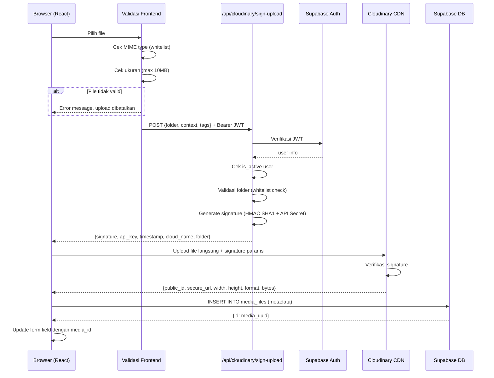
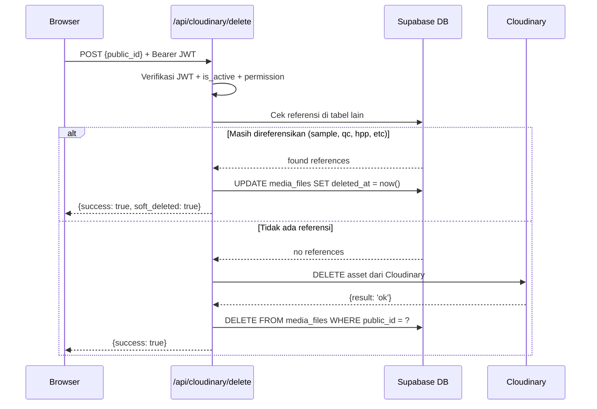

# CLOUDINARY — GG PRODUCT OS

**Versi:** 1.0  
**Status:** Draft Arsitektur  
**Provider Utama:** Cloudinary (media visual) + Supabase Storage (dokumen internal)

---

## 1. KEPUTUSAN PEMILIHAN PROVIDER

### Mengapa dua provider?

| Kebutuhan | Provider | Alasan |
|---|---|---|
| Foto produk, swatch, sample, QC | Cloudinary | Transformasi gambar (resize, format, quality), CDN global, thumbnail otomatis |
| Foto referensi, katalog | Cloudinary | Optimisasi WebP, lazy loading, responsive images |
| Profil pengguna | Cloudinary | Face-crop otomatis, avatar |
| PDF quotation, dokumen SOP | Supabase Storage | Signed URL aman, akses terkontrol, tidak butuh transformasi |
| Dokumen internal lainnya | Supabase Storage | Integrasi langsung dengan RLS |

### Mengapa Cloudinary untuk gambar?

- **Transformasi on-the-fly**: thumbnail, resize, crop, format WebP — tanpa menyimpan multiple copy
- **CDN global**: latency rendah untuk pengguna di Indonesia
- **Auto quality**: `q_auto` mengoptimalkan kualitas vs ukuran secara cerdas
- **Face detection**: untuk avatar profil (`g_face`)
- **Folder structure**: mendukung organisasi per brand dan artikel

### Media Adapter (abstraksi provider)

Dibuat interface `MediaAdapter` agar provider dapat diganti di masa depan tanpa mengubah seluruh codebase.

```typescript
// src/core/media/types.ts

export interface UploadOptions {
  folder: string;
  context?: Record<string, string>;
  tags?: string[];
  articleCode?: string;
  brand?: string;
}

export interface SignedUploadParams {
  signature: string;
  apiKey: string;
  timestamp: number;
  cloudName: string;
  folder: string;
}

export interface MediaUploadResult {
  publicId: string;
  secureUrl: string;
  url: string;
  width: number;
  height: number;
  format: string;
  bytes: number;
  folder: string;
}

export interface MediaAdapter {
  getSignedUploadParams(options: UploadOptions): Promise<SignedUploadParams>;
  deleteMedia(publicId: string): Promise<{ success: boolean; softDeleted?: boolean }>;
  getTransformedUrl(publicId: string, transformation: string): string;
  softDelete(mediaId: string): Promise<void>;
}
```

```typescript
// src/core/media/cloudinaryAdapter.ts
export class CloudinaryAdapter implements MediaAdapter {
  async getSignedUploadParams(options: UploadOptions): Promise<SignedUploadParams> {
    const response = await fetch('/api/cloudinary/sign-upload', {
      method: 'POST',
      headers: {
        'Content-Type': 'application/json',
        'Authorization': `Bearer ${await getAuthToken()}`,
      },
      body: JSON.stringify(options),
    });
    if (!response.ok) throw new Error('Failed to get upload signature');
    return response.json();
  }

  async deleteMedia(publicId: string) {
    const response = await fetch('/api/cloudinary/delete', {
      method: 'POST',
      headers: {
        'Content-Type': 'application/json',
        'Authorization': `Bearer ${await getAuthToken()}`,
      },
      body: JSON.stringify({ public_id: publicId }),
    });
    return response.json();
  }

  getTransformedUrl(publicId: string, transformation: string): string {
    const cloudName = import.meta.env.VITE_CLOUDINARY_CLOUD_NAME;
    return `https://res.cloudinary.com/${cloudName}/image/upload/${transformation}/${publicId}`;
  }

  async softDelete(mediaId: string): Promise<void> {
    await supabase
      .from('media_files')
      .update({ deleted_at: new Date().toISOString() })
      .eq('id', mediaId);
  }
}
```

---

## 2. STRUKTUR FOLDER CLOUDINARY

```
gg-product-os/
├── launch/
│   ├── gg-supply/
│   │   └── {article-code}/          ← mis: GGS-001-KAOS-POLOS
│   │       ├── references/          ← foto referensi brief artikel
│   │       ├── materials/           ← foto bahan/kain (candidate)
│   │       ├── swatches/            ← swatch warna fisik
│   │       ├── samples/
│   │       │   ├── v01/             ← foto sampel versi 1
│   │       │   ├── v02/             ← foto sampel versi 2
│   │       │   └── v03/             ← dst
│   │       ├── measurements/        ← foto size measurement
│   │       ├── qc/                  ← foto hasil QC
│   │       └── catalog/             ← foto final untuk katalog
│   └── gudskuy/
│       └── {article-code}/          ← mis: GDK-001-HOODIE-STREETWEAR
│           ├── references/
│           ├── materials/
│           ├── swatches/
│           ├── samples/
│           │   └── v01/
│           ├── measurements/
│           ├── qc/
│           └── catalog/
├── catalog/                         ← foto catalog published (copy dari launch/catalog/)
├── attendance/
│   └── evidence/                    ← foto bukti izin/sakit (feature flag OFF)
├── pos/
│   └── receipts/                    ← foto struk digital (feature flag OFF)
└── profiles/                        ← avatar pengguna
```

### Konvensi Penamaan Public ID

```
gg-product-os/launch/gg-supply/GGS-001/samples/v01/front-view
gg-product-os/launch/gudskuy/GDK-001/qc/stitch-detail
gg-product-os/profiles/user-uuid-avatar
```

---

## 3. UPLOAD SECURITY FLOW



---

## 4. DELETE FLOW



---

## 5. SERVERLESS FUNCTIONS

### 5.1 `POST /api/cloudinary/sign-upload`

```typescript
// api/cloudinary/sign-upload.ts
import type { VercelRequest, VercelResponse } from '@vercel/node';
import { createClient } from '@supabase/supabase-js';
import { v2 as cloudinary } from 'cloudinary';

cloudinary.config({
  cloud_name: process.env.VITE_CLOUDINARY_CLOUD_NAME!,
  api_key: process.env.CLOUDINARY_API_KEY!,
  api_secret: process.env.CLOUDINARY_API_SECRET!,
});

const ALLOWED_FOLDER_PREFIXES = [
  'gg-product-os/launch/',
  'gg-product-os/catalog/',
  'gg-product-os/profiles/',
  'gg-product-os/attendance/',
  'gg-product-os/pos/',
];

export default async function handler(req: VercelRequest, res: VercelResponse) {
  if (req.method !== 'POST') {
    return res.status(405).json({ error: 'Method not allowed' });
  }

  // 1. Autentikasi
  const token = req.headers.authorization?.replace('Bearer ', '');
  if (!token) return res.status(401).json({ error: 'Unauthorized' });

  const supabase = createClient(
    process.env.VITE_SUPABASE_URL!,
    process.env.SUPABASE_SERVICE_ROLE_KEY!
  );

  const { data: { user }, error: authError } = await supabase.auth.getUser(token);
  if (authError || !user) return res.status(401).json({ error: 'Invalid token' });

  // 2. Cek is_active
  const { data: profile } = await supabase
    .from('profiles')
    .select('is_active')
    .eq('id', user.id)
    .single();

  if (!profile?.is_active) {
    return res.status(403).json({ error: 'Akun tidak aktif' });
  }

  // 3. Validasi folder
  const { folder, context, tags } = req.body;
  if (!folder || typeof folder !== 'string') {
    return res.status(422).json({ error: 'Folder harus diisi' });
  }

  const isAllowed = ALLOWED_FOLDER_PREFIXES.some(prefix => folder.startsWith(prefix));
  if (!isAllowed) {
    return res.status(422).json({ error: 'Folder tidak diizinkan' });
  }

  // 4. Generate signature
  const timestamp = Math.round(Date.now() / 1000);
  const paramsToSign: Record<string, string | number> = {
    folder,
    timestamp,
  };
  if (context) paramsToSign.context = JSON.stringify(context);
  if (tags?.length) paramsToSign.tags = tags.join(',');

  const signature = cloudinary.utils.api_sign_request(
    paramsToSign,
    process.env.CLOUDINARY_API_SECRET!
  );

  return res.status(200).json({
    signature,
    api_key: process.env.CLOUDINARY_API_KEY!,
    timestamp,
    cloud_name: process.env.VITE_CLOUDINARY_CLOUD_NAME!,
    folder,
  });
}
```

### 5.2 `POST /api/cloudinary/delete`

```typescript
// api/cloudinary/delete.ts
import type { VercelRequest, VercelResponse } from '@vercel/node';
import { createClient } from '@supabase/supabase-js';
import { v2 as cloudinary } from 'cloudinary';

cloudinary.config({
  cloud_name: process.env.VITE_CLOUDINARY_CLOUD_NAME!,
  api_key: process.env.CLOUDINARY_API_KEY!,
  api_secret: process.env.CLOUDINARY_API_SECRET!,
});

// Tabel yang mereferensikan media_files
const REFERENCE_TABLES = [
  { table: 'launch_work_orders', column: 'hero_media_id' },
  { table: 'launch_material_candidates', column: 'swatch_media_id' },
  { table: 'launch_supplier_quotes', column: 'quotation_media_id' },
  { table: 'launch_article_colors', column: 'swatch_media_id' },
  { table: 'launch_samples', column: 'id' },  // via join ke media
  { table: 'launch_measurement_points', column: 'diagram_media_id' },
  { table: 'launch_qc_results', column: 'id' },
  { table: 'catalog_products', column: 'hero_media_id' },
];

export default async function handler(req: VercelRequest, res: VercelResponse) {
  if (req.method !== 'POST') return res.status(405).end();

  const token = req.headers.authorization?.replace('Bearer ', '');
  if (!token) return res.status(401).json({ error: 'Unauthorized' });

  const supabase = createClient(
    process.env.VITE_SUPABASE_URL!,
    process.env.SUPABASE_SERVICE_ROLE_KEY!
  );

  const { data: { user }, error } = await supabase.auth.getUser(token);
  if (error || !user) return res.status(401).json({ error: 'Invalid token' });

  const { public_id } = req.body;
  if (!public_id) return res.status(422).json({ error: 'public_id harus diisi' });

  // Cek apakah masih ada referensi
  const { data: mediaFile } = await supabase
    .from('media_files')
    .select('id')
    .eq('public_id', public_id)
    .single();

  if (!mediaFile) return res.status(404).json({ error: 'Media tidak ditemukan' });

  // Cek referensi (simplified — cek tabel utama)
  const { count: sampleRefCount } = await supabase
    .from('launch_sample_measurements')
    .select('*', { count: 'exact', head: true })
    .eq('media_id', mediaFile.id);

  const hasReferences = (sampleRefCount ?? 0) > 0;

  if (hasReferences) {
    // Soft delete saja
    await supabase
      .from('media_files')
      .update({ deleted_at: new Date().toISOString() })
      .eq('id', mediaFile.id);

    return res.status(200).json({ success: true, soft_deleted: true });
  }

  // Hard delete dari Cloudinary
  await cloudinary.uploader.destroy(public_id);

  // Hapus dari database
  await supabase
    .from('media_files')
    .delete()
    .eq('id', mediaFile.id);

  return res.status(200).json({ success: true });
}
```

---

## 6. TRANSFORMASI URL

Gunakan helper function untuk generate URL Cloudinary yang sudah ditransformasi:

```typescript
// src/core/media/cloudinaryUtils.ts
const CLOUD_NAME = import.meta.env.VITE_CLOUDINARY_CLOUD_NAME;
const BASE_URL = `https://res.cloudinary.com/${CLOUD_NAME}/image/upload`;

export const CloudinaryTransforms = {
  // Thumbnail untuk daftar (300x300, fill, WebP)
  thumbnail: (publicId: string) =>
    `${BASE_URL}/w_300,h_300,c_fill,f_webp,q_auto/${publicId}`,

  // Preview detail artikel (800px, limit aspect, WebP)
  preview: (publicId: string) =>
    `${BASE_URL}/w_800,h_800,c_limit,f_webp,q_auto/${publicId}`,

  // Katalog hero (1200x900, fill, kualitas terbaik)
  catalogHero: (publicId: string) =>
    `${BASE_URL}/w_1200,h_900,c_fill,f_webp,q_auto:best/${publicId}`,

  // Swatch warna kecil (100x100)
  swatch: (publicId: string) =>
    `${BASE_URL}/w_100,h_100,c_fill,f_webp/${publicId}`,

  // Avatar profil (64x64, circle crop, face detection)
  avatar: (publicId: string) =>
    `${BASE_URL}/w_64,h_64,c_fill,g_face,r_max,f_webp/${publicId}`,

  // Foto sampel (600x600, pad untuk mempertahankan ratio)
  samplePhoto: (publicId: string) =>
    `${BASE_URL}/w_600,h_600,c_pad,b_white,f_webp,q_auto/${publicId}`,

  // Original (untuk download atau QC detail)
  original: (publicId: string) =>
    `${BASE_URL}/f_auto,q_auto/${publicId}`,
};
```

---

## 7. REACT COMPONENT INTEGRATION

```typescript
// src/core/media/FileUploadZone.tsx
import { useState, useCallback } from 'react';
import { CloudinaryAdapter } from './cloudinaryAdapter';

interface FileUploadZoneProps {
  folder: string;
  onUploadComplete: (result: MediaUploadResult) => void;
  accept?: string;
  maxSizeMB?: number;
}

const adapter = new CloudinaryAdapter();

export function FileUploadZone({
  folder,
  onUploadComplete,
  accept = 'image/jpeg,image/png,image/webp',
  maxSizeMB = 10,
}: FileUploadZoneProps) {
  const [uploading, setUploading] = useState(false);
  const [error, setError] = useState<string | null>(null);
  const [progress, setProgress] = useState(0);

  const handleUpload = useCallback(async (file: File) => {
    setError(null);

    // Validasi frontend
    const maxBytes = maxSizeMB * 1024 * 1024;
    if (file.size > maxBytes) {
      setError(`Ukuran file melebihi ${maxSizeMB}MB`);
      return;
    }
    if (!accept.split(',').includes(file.type)) {
      setError('Format file tidak didukung');
      return;
    }

    setUploading(true);
    try {
      // 1. Minta signature dari server
      const signParams = await adapter.getSignedUploadParams({ folder });

      // 2. Upload ke Cloudinary
      const formData = new FormData();
      formData.append('file', file);
      formData.append('api_key', signParams.apiKey);
      formData.append('timestamp', String(signParams.timestamp));
      formData.append('signature', signParams.signature);
      formData.append('folder', signParams.folder);

      const response = await fetch(
        `https://api.cloudinary.com/v1_1/${signParams.cloudName}/image/upload`,
        { method: 'POST', body: formData }
      );

      if (!response.ok) throw new Error('Upload gagal');
      const result = await response.json();

      // 3. Simpan metadata ke database
      const { data: mediaFile } = await supabase
        .from('media_files')
        .insert({
          provider: 'cloudinary',
          public_id: result.public_id,
          secure_url: result.secure_url,
          url: result.url,
          folder: result.folder,
          mime_type: file.type,
          file_size: result.bytes,
          width: result.width,
          height: result.height,
          original_filename: file.name,
        })
        .select()
        .single();

      onUploadComplete({ ...result, mediaId: mediaFile.id });
    } catch (err) {
      setError('Upload gagal. Silakan coba lagi.');
    } finally {
      setUploading(false);
    }
  }, [folder, maxSizeMB, accept, onUploadComplete]);

  return (
    <div className="upload-zone" /* ...styling */>
      {uploading && <div>Uploading... {progress}%</div>}
      {error && <div className="error">{error}</div>}
      <input
        type="file"
        accept={accept}
        onChange={(e) => e.target.files?.[0] && handleUpload(e.target.files[0])}
      />
    </div>
  );
}
```

---

## 8. TABEL `media_files`

```sql
CREATE TABLE media_files (
  id              UUID PRIMARY KEY DEFAULT gen_random_uuid(),
  provider        TEXT NOT NULL DEFAULT 'cloudinary'
                  CHECK (provider IN ('cloudinary', 'supabase_storage')),
  public_id       TEXT NOT NULL,
  url             TEXT,
  secure_url      TEXT NOT NULL,
  folder          TEXT,
  original_filename TEXT,
  mime_type       TEXT,
  file_size       INTEGER CHECK (file_size >= 0),
  width           INTEGER CHECK (width > 0),
  height          INTEGER CHECK (height > 0),
  metadata        JSONB DEFAULT '{}',
  uploaded_by     UUID REFERENCES profiles(id) ON DELETE SET NULL,
  created_at      TIMESTAMPTZ DEFAULT now(),
  deleted_at      TIMESTAMPTZ  -- soft delete
);

-- Index
CREATE INDEX idx_media_files_public_id ON media_files(public_id);
CREATE INDEX idx_media_files_uploaded_by ON media_files(uploaded_by);
CREATE INDEX idx_media_files_deleted_at ON media_files(deleted_at)
  WHERE deleted_at IS NULL;  -- partial index untuk yang belum dihapus
CREATE INDEX idx_media_files_folder ON media_files(folder);
```

---

## 9. LARANGAN

1. ❌ **Jangan simpan `CLOUDINARY_API_SECRET` di environment variable dengan prefix `VITE_`** — akan bocor ke bundle frontend
2. ❌ **Jangan gunakan unsigned upload preset di production** — tidak ada validasi signature
3. ❌ **Jangan simpan base64 gambar di database** — gunakan URL Cloudinary
4. ❌ **Jangan hapus media yang masih direferensikan histori sampel** — gunakan soft delete
5. ❌ **Jangan menyimpan multiple resize di storage** — manfaatkan transformasi Cloudinary on-the-fly
6. ❌ **Jangan mengambil gambar full resolution untuk tampilan daftar** — gunakan thumbnail transformation

---

## 10. BACKUP DAN RETENTION

- Cloudinary Pro: built-in backup, 30-day version history
- Media yang di-soft-delete: cleanup job bulanan (hapus dari Cloudinary jika tidak ada referensi aktif setelah 90 hari)
- Media terkait sample versi lama: **tidak dihapus** — histori sampling harus dapat ditelusuri
- Cleanup job: scheduled function Vercel (cron) yang berjalan setiap hari

---

*Akhir dokumen cloudinary.md*
