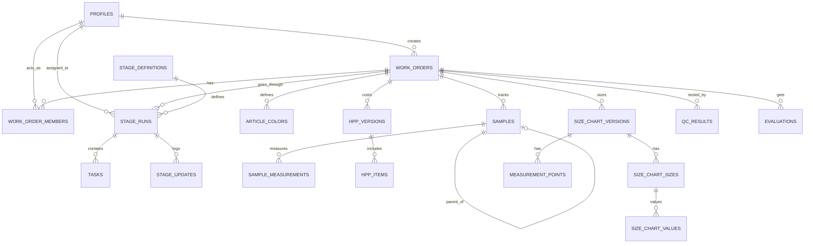
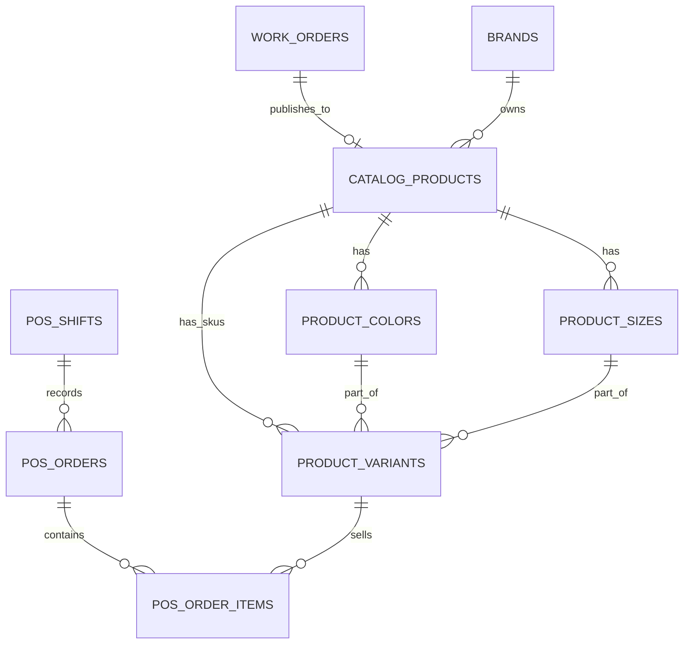

# Database Design & Architecture - GG Product OS

Dokumen ini mendefinisikan arsitektur database secara komprehensif untuk GG Product OS. Menggunakan Supabase PostgreSQL sebagai basis data utama, dokumen ini mencakup desain tabel, tipe data, konvensi, relasi, strategi indexing, Row Level Security (RLS), dan mekanisme khusus seperti *versioning*, *audit logging*, dan *soft delete*.

---

## 1. Prinsip Database Design

Dalam merancang struktur database GG Product OS, kami berpegang pada prinsip-prinsip berikut:
1. **Security-First (RLS):** Semua akses ke tabel diatur menggunakan Supabase Row Level Security (RLS). Aplikasi klien tidak akan memiliki akses langsung ke seluruh data.
2. **Auditability:** Setiap tabel kritikal harus memiliki kolom `created_at`, `updated_at`, dan `created_by`. Perubahan data yang sangat penting direkam dalam tabel `audit_logs`.
3. **Immutability pada Data Finansial & Standar:** Data HPP (Harga Pokok Penjualan), Size Chart, dan Master Sample tidak boleh diubah secara *in-place* setelah berstatus FINAL/MASTER. Harus menggunakan *versioning* (versi baru).
4. **Referential Integrity:** Penggunaan Foreign Key (FK) diwajibkan untuk menjamin konsistensi data. Cascade delete sebisa mungkin dihindari, diganti dengan *soft delete* (misal `deleted_at`) atau set null.
5. **JSONB untuk Ekstensibilitas:** Properti yang dinamis atau tidak terstruktur akan menggunakan tipe data JSONB (seperti `metadata` atau `completion_rules`).

## 2. Konvensi Penamaan dan Tipe Data

- **Tabel dan Kolom:** Menggunakan `snake_case` (contoh: `work_orders`, `progress_percent`). Nama tabel selalu berbentuk jamak (plural).
- **Primary Key:** Selalu dinamai `id` dan bertipe `UUID` (dibuat menggunakan `uuid_generate_v4()`).
- **Foreign Key:** Menggunakan format `nama_tabel_tunggal_id` (contoh: `brand_id`, `user_id`).
- **Tipe Waktu:** Menggunakan `TIMESTAMP WITH TIME ZONE` (`timestamptz`) untuk menghindari zona waktu yang ambigu.
- **Boolean:** Selalu diawali dengan prefix `is_`, `has_`, atau `can_` (contoh: `is_active`, `has_custom_capability`).
- **Enum / Status:** Disimpan sebagai `TEXT` dengan batasan `CHECK` constraint (lebih fleksibel dibanding PostgreSQL ENUM asli ketika migrasi) atau `VARCHAR`.

---

## 3. Struktur Tabel & Skema SQL Lengkap

Berikut adalah rancangan SQL tabel yang dibagi ke dalam beberapa kelompok.

### 3.1. Tabel CORE (Migration Fondasi)
Menangani pengguna, otorisasi RBAC, feature flag, audit, dan media.

```sql
-- Extension wajib
CREATE EXTENSION IF NOT EXISTS "uuid-ossp";

-- PROFILES
CREATE TABLE profiles (
    id UUID PRIMARY KEY REFERENCES auth.users(id) ON DELETE CASCADE,
    full_name TEXT NOT NULL,
    email TEXT NOT NULL UNIQUE,
    phone TEXT,
    avatar_url TEXT,
    job_title TEXT,
    department TEXT,
    is_active BOOLEAN DEFAULT TRUE,
    created_at TIMESTAMPTZ DEFAULT NOW(),
    updated_at TIMESTAMPTZ DEFAULT NOW()
);

-- ROLES
CREATE TABLE roles (
    id UUID PRIMARY KEY DEFAULT uuid_generate_v4(),
    code TEXT UNIQUE NOT NULL,
    name TEXT NOT NULL,
    description TEXT,
    is_system BOOLEAN DEFAULT FALSE,
    created_at TIMESTAMPTZ DEFAULT NOW()
);

-- PERMISSIONS
CREATE TABLE permissions (
    id UUID PRIMARY KEY DEFAULT uuid_generate_v4(),
    code TEXT UNIQUE NOT NULL,
    module TEXT NOT NULL,
    description TEXT,
    created_at TIMESTAMPTZ DEFAULT NOW()
);

-- ROLE PERMISSIONS (Junction)
CREATE TABLE role_permissions (
    role_id UUID REFERENCES roles(id) ON DELETE CASCADE,
    permission_id UUID REFERENCES permissions(id) ON DELETE CASCADE,
    is_allowed BOOLEAN DEFAULT TRUE,
    PRIMARY KEY(role_id, permission_id)
);

-- USER ROLES
CREATE TABLE user_roles (
    id UUID PRIMARY KEY DEFAULT uuid_generate_v4(),
    user_id UUID REFERENCES profiles(id) ON DELETE CASCADE,
    role_id UUID REFERENCES roles(id) ON DELETE CASCADE,
    assigned_by UUID REFERENCES profiles(id),
    assigned_at TIMESTAMPTZ DEFAULT NOW(),
    UNIQUE(user_id, role_id)
);

-- USER PERMISSION OVERRIDES
CREATE TABLE user_permission_overrides (
    id UUID PRIMARY KEY DEFAULT uuid_generate_v4(),
    user_id UUID REFERENCES profiles(id) ON DELETE CASCADE,
    permission_id UUID REFERENCES permissions(id) ON DELETE CASCADE,
    is_allowed BOOLEAN NOT NULL,
    granted_by UUID REFERENCES profiles(id),
    created_at TIMESTAMPTZ DEFAULT NOW(),
    UNIQUE(user_id, permission_id)
);

-- FEATURE FLAGS
CREATE TABLE feature_flags (
    code TEXT PRIMARY KEY,
    is_enabled BOOLEAN DEFAULT FALSE,
    description TEXT,
    updated_by UUID REFERENCES profiles(id),
    updated_at TIMESTAMPTZ DEFAULT NOW()
);

-- AUDIT LOGS
CREATE TABLE audit_logs (
    id UUID PRIMARY KEY DEFAULT uuid_generate_v4(),
    module TEXT NOT NULL,
    entity_type TEXT NOT NULL,
    entity_id UUID,
    action TEXT NOT NULL, -- INSERT, UPDATE, DELETE
    before_data JSONB,
    after_data JSONB,
    actor_user_id UUID REFERENCES profiles(id),
    created_at TIMESTAMPTZ DEFAULT NOW(),
    request_id TEXT
);

-- MEDIA FILES
CREATE TABLE media_files (
    id UUID PRIMARY KEY DEFAULT uuid_generate_v4(),
    provider TEXT NOT NULL, -- s3, cloudinary, local
    public_id TEXT NOT NULL,
    url TEXT NOT NULL,
    secure_url TEXT NOT NULL,
    folder TEXT,
    original_filename TEXT,
    mime_type TEXT,
    file_size INTEGER,
    width INTEGER,
    height INTEGER,
    metadata JSONB,
    uploaded_by UUID REFERENCES profiles(id),
    created_at TIMESTAMPTZ DEFAULT NOW(),
    deleted_at TIMESTAMPTZ -- soft delete
);
```

### 3.2. Tabel PRODUCT LAUNCH (Migration Fondasi + MVP)
Mengelola pembuatan produk mulai dari perancangan awal hingga masuk ke katalog.

```sql
-- BRANDS
CREATE TABLE launch_brands (
    id UUID PRIMARY KEY DEFAULT uuid_generate_v4(),
    code TEXT UNIQUE NOT NULL,
    name TEXT NOT NULL,
    description TEXT,
    is_active BOOLEAN DEFAULT TRUE,
    created_at TIMESTAMPTZ DEFAULT NOW(),
    updated_at TIMESTAMPTZ DEFAULT NOW()
);

-- WORK ORDERS
CREATE TABLE launch_work_orders (
    id UUID PRIMARY KEY DEFAULT uuid_generate_v4(),
    brand_id UUID REFERENCES launch_brands(id),
    article_code TEXT UNIQUE NOT NULL,
    article_name TEXT NOT NULL,
    category TEXT NOT NULL,
    product_type TEXT NOT NULL,
    purpose TEXT,
    target_market TEXT,
    description TEXT,
    custom_capability BOOLEAN DEFAULT FALSE,
    priority TEXT CHECK (priority IN ('LOW', 'MEDIUM', 'HIGH', 'URGENT')),
    target_date DATE,
    primary_pic_user_id UUID REFERENCES profiles(id),
    current_stage_code TEXT,
    overall_status TEXT CHECK (overall_status IN ('DRAFT', 'ACTIVE', 'ON_HOLD', 'IN_REVIEW', 'APPROVED', 'PUBLISHED', 'CANCELLED', 'ARCHIVED')) DEFAULT 'DRAFT',
    progress_percent INTEGER DEFAULT 0,
    reference_url TEXT,
    hero_media_id UUID REFERENCES media_files(id),
    created_by UUID REFERENCES profiles(id),
    created_at TIMESTAMPTZ DEFAULT NOW(),
    updated_at TIMESTAMPTZ DEFAULT NOW(),
    approved_by UUID REFERENCES profiles(id),
    approved_at TIMESTAMPTZ,
    cancelled_at TIMESTAMPTZ,
    cancel_reason TEXT,
    published_catalog_product_id UUID -- Referensi tunda ke tabel catalog
);

-- WORK ORDER MEMBERS
CREATE TABLE launch_work_order_members (
    id UUID PRIMARY KEY DEFAULT uuid_generate_v4(),
    work_order_id UUID REFERENCES launch_work_orders(id) ON DELETE CASCADE,
    user_id UUID REFERENCES profiles(id),
    role_in_order TEXT NOT NULL,
    assigned_at TIMESTAMPTZ DEFAULT NOW(),
    UNIQUE(work_order_id, user_id)
);

-- STAGE DEFINITIONS
CREATE TABLE launch_stage_definitions (
    id UUID PRIMARY KEY DEFAULT uuid_generate_v4(),
    code TEXT UNIQUE NOT NULL,
    name TEXT NOT NULL,
    sequence_no INTEGER NOT NULL,
    description TEXT,
    weight INTEGER DEFAULT 0,
    completion_rules JSONB,
    is_active BOOLEAN DEFAULT TRUE
);

-- STAGE RUNS
CREATE TABLE launch_stage_runs (
    id UUID PRIMARY KEY DEFAULT uuid_generate_v4(),
    work_order_id UUID REFERENCES launch_work_orders(id) ON DELETE CASCADE,
    stage_id UUID REFERENCES launch_stage_definitions(id),
    status TEXT CHECK (status IN ('NOT_STARTED', 'IN_PROGRESS', 'WAITING_MATERIAL', 'WAITING_DECISION', 'REVISION_REQUIRED', 'IN_REVIEW', 'BLOCKED', 'COMPLETED', 'CANCELLED')) DEFAULT 'NOT_STARTED',
    assigned_user_id UUID REFERENCES profiles(id),
    started_at TIMESTAMPTZ,
    completed_at TIMESTAMPTZ,
    created_at TIMESTAMPTZ DEFAULT NOW(),
    updated_at TIMESTAMPTZ DEFAULT NOW()
);

-- TASKS
CREATE TABLE launch_tasks (
    id UUID PRIMARY KEY DEFAULT uuid_generate_v4(),
    stage_run_id UUID REFERENCES launch_stage_runs(id) ON DELETE CASCADE,
    title TEXT NOT NULL,
    description TEXT,
    status TEXT CHECK (status IN ('TODO', 'IN_PROGRESS', 'WAITING', 'BLOCKED', 'DONE', 'CANCELLED')) DEFAULT 'TODO',
    assigned_user_id UUID REFERENCES profiles(id),
    due_date DATE,
    completed_at TIMESTAMPTZ,
    created_at TIMESTAMPTZ DEFAULT NOW(),
    updated_at TIMESTAMPTZ DEFAULT NOW()
);

-- STAGE UPDATES
CREATE TABLE launch_stage_updates (
    id UUID PRIMARY KEY DEFAULT uuid_generate_v4(),
    stage_run_id UUID REFERENCES launch_stage_runs(id) ON DELETE CASCADE,
    author_id UUID REFERENCES profiles(id),
    content TEXT NOT NULL,
    attachment_media_ids UUID[], -- Array of media_files ID
    created_at TIMESTAMPTZ DEFAULT NOW()
);

-- MATERIALS & SUPPLIERS
CREATE TABLE launch_suppliers (
    id UUID PRIMARY KEY DEFAULT uuid_generate_v4(),
    name TEXT NOT NULL,
    contact_person TEXT,
    phone TEXT,
    email TEXT,
    address TEXT,
    is_active BOOLEAN DEFAULT TRUE,
    created_at TIMESTAMPTZ DEFAULT NOW()
);

CREATE TABLE launch_material_candidates (
    id UUID PRIMARY KEY DEFAULT uuid_generate_v4(),
    work_order_id UUID REFERENCES launch_work_orders(id) ON DELETE CASCADE,
    name TEXT NOT NULL,
    type TEXT NOT NULL,
    specification TEXT,
    supplier_id UUID REFERENCES launch_suppliers(id),
    status TEXT DEFAULT 'PROPOSED',
    created_at TIMESTAMPTZ DEFAULT NOW(),
    updated_at TIMESTAMPTZ DEFAULT NOW()
);

CREATE TABLE launch_supplier_quotes (
    id UUID PRIMARY KEY DEFAULT uuid_generate_v4(),
    material_id UUID REFERENCES launch_material_candidates(id) ON DELETE CASCADE,
    supplier_id UUID REFERENCES launch_suppliers(id),
    price DECIMAL(12,2) NOT NULL,
    moq INTEGER,
    lead_time_days INTEGER,
    valid_until DATE,
    created_at TIMESTAMPTZ DEFAULT NOW()
);

-- ARTICLE COLORS
CREATE TABLE launch_article_colors (
    id UUID PRIMARY KEY DEFAULT uuid_generate_v4(),
    work_order_id UUID REFERENCES launch_work_orders(id) ON DELETE CASCADE,
    color_code TEXT NOT NULL,
    color_name TEXT NOT NULL,
    hex_value TEXT,
    created_at TIMESTAMPTZ DEFAULT NOW(),
    UNIQUE(work_order_id, color_code)
);

-- SAMPLES (VERSIONED)
CREATE TABLE launch_samples (
    id UUID PRIMARY KEY DEFAULT uuid_generate_v4(),
    work_order_id UUID REFERENCES launch_work_orders(id) ON DELETE CASCADE,
    parent_sample_id UUID REFERENCES launch_samples(id), -- Untuk tree struktur
    version_no INTEGER NOT NULL,
    status TEXT CHECK (status IN ('DRAFT', 'REVISION', 'APPROVED', 'MASTER')) DEFAULT 'DRAFT',
    feedback_notes TEXT,
    created_by UUID REFERENCES profiles(id),
    created_at TIMESTAMPTZ DEFAULT NOW(),
    updated_at TIMESTAMPTZ DEFAULT NOW()
);

CREATE TABLE launch_sample_measurements (
    id UUID PRIMARY KEY DEFAULT uuid_generate_v4(),
    sample_id UUID REFERENCES launch_samples(id) ON DELETE CASCADE,
    point_name TEXT NOT NULL,
    target_value DECIMAL(8,2) NOT NULL,
    actual_value DECIMAL(8,2),
    tolerance DECIMAL(8,2) DEFAULT 0.5,
    is_passed BOOLEAN,
    notes TEXT
);

-- HPP (VERSIONED)
CREATE TABLE launch_hpp_versions (
    id UUID PRIMARY KEY DEFAULT uuid_generate_v4(),
    work_order_id UUID REFERENCES launch_work_orders(id) ON DELETE CASCADE,
    version_no INTEGER NOT NULL,
    status TEXT CHECK (status IN ('DRAFT', 'FINAL')) DEFAULT 'DRAFT',
    reject_pct DECIMAL(5,2) DEFAULT 0,
    overhead_pct DECIMAL(5,2) DEFAULT 0,
    target_margin_pct DECIMAL(5,2) DEFAULT 0,
    notes TEXT,
    created_by UUID REFERENCES profiles(id),
    created_at TIMESTAMPTZ DEFAULT NOW(),
    updated_at TIMESTAMPTZ DEFAULT NOW()
);

CREATE TABLE launch_hpp_items (
    id UUID PRIMARY KEY DEFAULT uuid_generate_v4(),
    hpp_version_id UUID REFERENCES launch_hpp_versions(id) ON DELETE CASCADE,
    item_type TEXT NOT NULL, -- MATERIAL, ACCESSORY, LABOR, OTHER
    name TEXT NOT NULL,
    qty DECIMAL(10,2) NOT NULL,
    unit TEXT NOT NULL,
    unit_cost DECIMAL(12,2) NOT NULL,
    total_cost DECIMAL(12,2) GENERATED ALWAYS AS (qty * unit_cost) STORED,
    created_at TIMESTAMPTZ DEFAULT NOW()
);

-- SIZE CHARTS (VERSIONED)
CREATE TABLE launch_size_chart_versions (
    id UUID PRIMARY KEY DEFAULT uuid_generate_v4(),
    work_order_id UUID REFERENCES launch_work_orders(id) ON DELETE CASCADE,
    version_no INTEGER NOT NULL,
    status TEXT CHECK (status IN ('DRAFT', 'FINAL')) DEFAULT 'DRAFT',
    created_by UUID REFERENCES profiles(id),
    created_at TIMESTAMPTZ DEFAULT NOW()
);

CREATE TABLE launch_size_chart_sizes (
    id UUID PRIMARY KEY DEFAULT uuid_generate_v4(),
    version_id UUID REFERENCES launch_size_chart_versions(id) ON DELETE CASCADE,
    size_code TEXT NOT NULL,
    sequence_no INTEGER DEFAULT 0
);

CREATE TABLE launch_measurement_points (
    id UUID PRIMARY KEY DEFAULT uuid_generate_v4(),
    version_id UUID REFERENCES launch_size_chart_versions(id) ON DELETE CASCADE,
    point_code TEXT NOT NULL,
    point_name TEXT NOT NULL,
    description TEXT,
    sequence_no INTEGER DEFAULT 0
);

CREATE TABLE launch_size_chart_values (
    id UUID PRIMARY KEY DEFAULT uuid_generate_v4(),
    size_id UUID REFERENCES launch_size_chart_sizes(id) ON DELETE CASCADE,
    point_id UUID REFERENCES launch_measurement_points(id) ON DELETE CASCADE,
    value DECIMAL(8,2) NOT NULL,
    UNIQUE(size_id, point_id)
);

-- QC & EVALUATIONS
CREATE TABLE launch_qc_templates (
    id UUID PRIMARY KEY DEFAULT uuid_generate_v4(),
    name TEXT NOT NULL,
    product_category TEXT NOT NULL,
    is_active BOOLEAN DEFAULT TRUE
);

CREATE TABLE launch_qc_template_items (
    id UUID PRIMARY KEY DEFAULT uuid_generate_v4(),
    template_id UUID REFERENCES launch_qc_templates(id) ON DELETE CASCADE,
    criteria TEXT NOT NULL,
    method TEXT,
    importance TEXT CHECK (importance IN ('MINOR', 'MAJOR', 'CRITICAL'))
);

CREATE TABLE launch_qc_results (
    id UUID PRIMARY KEY DEFAULT uuid_generate_v4(),
    work_order_id UUID REFERENCES launch_work_orders(id) ON DELETE CASCADE,
    template_id UUID REFERENCES launch_qc_templates(id),
    sample_id UUID REFERENCES launch_samples(id),
    inspector_id UUID REFERENCES profiles(id),
    inspection_date DATE,
    overall_result TEXT CHECK (overall_result IN ('PASS', 'FAIL', 'CONDITIONAL_PASS')),
    notes TEXT,
    created_at TIMESTAMPTZ DEFAULT NOW()
);

CREATE TABLE launch_evaluations (
    id UUID PRIMARY KEY DEFAULT uuid_generate_v4(),
    work_order_id UUID REFERENCES launch_work_orders(id) ON DELETE CASCADE,
    evaluator_id UUID REFERENCES profiles(id),
    evaluation_type TEXT, -- TECHNICAL, COMMERCIAL, MANAGEMENT
    rating INTEGER CHECK (rating >= 1 AND rating <= 5),
    feedback TEXT,
    created_at TIMESTAMPTZ DEFAULT NOW()
);
```

### 3.3. Tabel CATALOG (Migration Fondasi)
Mengelola produk yang sudah rilis (di-_publish_ dari Work Order).

```sql
CREATE TABLE catalog_products (
    id UUID PRIMARY KEY DEFAULT uuid_generate_v4(),
    source_work_order_id UUID REFERENCES launch_work_orders(id),
    brand_id UUID REFERENCES launch_brands(id),
    code TEXT UNIQUE NOT NULL,
    name TEXT NOT NULL,
    description TEXT,
    category TEXT NOT NULL,
    base_price DECIMAL(12,2),
    status TEXT CHECK (status IN ('DRAFT', 'ACTIVE', 'INACTIVE', 'ARCHIVED')) DEFAULT 'DRAFT',
    created_at TIMESTAMPTZ DEFAULT NOW(),
    updated_at TIMESTAMPTZ DEFAULT NOW()
);

CREATE TABLE catalog_product_colors (
    id UUID PRIMARY KEY DEFAULT uuid_generate_v4(),
    product_id UUID REFERENCES catalog_products(id) ON DELETE CASCADE,
    color_code TEXT NOT NULL,
    color_name TEXT NOT NULL,
    hex_value TEXT,
    media_ids UUID[]
);

CREATE TABLE catalog_product_sizes (
    id UUID PRIMARY KEY DEFAULT uuid_generate_v4(),
    product_id UUID REFERENCES catalog_products(id) ON DELETE CASCADE,
    size_code TEXT NOT NULL
);

CREATE TABLE catalog_product_variants (
    id UUID PRIMARY KEY DEFAULT uuid_generate_v4(),
    product_id UUID REFERENCES catalog_products(id) ON DELETE CASCADE,
    color_id UUID REFERENCES catalog_product_colors(id),
    size_id UUID REFERENCES catalog_product_sizes(id),
    sku TEXT UNIQUE NOT NULL,
    barcode TEXT UNIQUE,
    price DECIMAL(12,2),
    stock_qty INTEGER DEFAULT 0,
    created_at TIMESTAMPTZ DEFAULT NOW(),
    updated_at TIMESTAMPTZ DEFAULT NOW()
);

-- ADD FK dari Work Order ke Catalog
ALTER TABLE launch_work_orders ADD CONSTRAINT fk_published_catalog
    FOREIGN KEY (published_catalog_product_id) REFERENCES catalog_products(id);
```

### 3.4. Tabel ATTENDANCE (Migration DITUNDA)

```sql
-- DITUNDA KE FASE 2
CREATE TABLE attendance_locations (
    id UUID PRIMARY KEY DEFAULT uuid_generate_v4(),
    name TEXT NOT NULL,
    address TEXT,
    latitude DECIMAL(10,8),
    longitude DECIMAL(11,8),
    radius_meters INTEGER DEFAULT 100,
    is_active BOOLEAN DEFAULT TRUE
);

CREATE TABLE attendance_shift_templates (
    id UUID PRIMARY KEY DEFAULT uuid_generate_v4(),
    code TEXT UNIQUE NOT NULL,
    name TEXT NOT NULL,
    start_time TIME NOT NULL,
    end_time TIME NOT NULL,
    grace_period_mins INTEGER DEFAULT 15,
    is_active BOOLEAN DEFAULT TRUE
);

CREATE TABLE attendance_schedules (
    id UUID PRIMARY KEY DEFAULT uuid_generate_v4(),
    user_id UUID REFERENCES profiles(id) ON DELETE CASCADE,
    shift_id UUID REFERENCES attendance_shift_templates(id),
    location_id UUID REFERENCES attendance_locations(id),
    date DATE NOT NULL,
    UNIQUE(user_id, date)
);

CREATE TABLE attendance_records (
    id UUID PRIMARY KEY DEFAULT uuid_generate_v4(),
    user_id UUID REFERENCES profiles(id) ON DELETE CASCADE,
    schedule_id UUID REFERENCES attendance_schedules(id),
    date DATE NOT NULL,
    check_in_time TIMESTAMPTZ,
    check_out_time TIMESTAMPTZ,
    check_in_location JSONB,
    check_out_location JSONB,
    status TEXT CHECK (status IN ('PRESENT', 'LATE', 'PERMISSION', 'SICK', 'ABSENT', 'HOLIDAY', 'OFF', 'INCOMPLETE')),
    notes TEXT,
    created_at TIMESTAMPTZ DEFAULT NOW()
);

CREATE TABLE attendance_requests (
    id UUID PRIMARY KEY DEFAULT uuid_generate_v4(),
    user_id UUID REFERENCES profiles(id),
    request_type TEXT, -- LEAVE, SICK, PERMISSION
    start_date DATE NOT NULL,
    end_date DATE NOT NULL,
    reason TEXT,
    status TEXT DEFAULT 'PENDING', -- PENDING, APPROVED, REJECTED
    approved_by UUID REFERENCES profiles(id),
    created_at TIMESTAMPTZ DEFAULT NOW()
);

CREATE TABLE attendance_corrections (
    id UUID PRIMARY KEY DEFAULT uuid_generate_v4(),
    record_id UUID REFERENCES attendance_records(id),
    requested_by UUID REFERENCES profiles(id),
    correction_type TEXT,
    proposed_time TIMESTAMPTZ,
    reason TEXT,
    status TEXT DEFAULT 'PENDING',
    resolved_by UUID REFERENCES profiles(id),
    created_at TIMESTAMPTZ DEFAULT NOW()
);

CREATE TABLE attendance_daily_activities (
    id UUID PRIMARY KEY DEFAULT uuid_generate_v4(),
    user_id UUID REFERENCES profiles(id),
    date DATE NOT NULL,
    activity_description TEXT,
    hours_spent DECIMAL(4,2),
    created_at TIMESTAMPTZ DEFAULT NOW()
);
```

### 3.5. Tabel POS SELLER (Migration DITUNDA)

```sql
-- DITUNDA KE FASE 2
CREATE TABLE pos_seller_profiles (
    id UUID PRIMARY KEY DEFAULT uuid_generate_v4(),
    user_id UUID REFERENCES profiles(id),
    store_location_id UUID REFERENCES attendance_locations(id),
    pin_hash TEXT,
    is_active BOOLEAN DEFAULT TRUE
);

CREATE TABLE pos_shifts (
    id UUID PRIMARY KEY DEFAULT uuid_generate_v4(),
    seller_id UUID REFERENCES pos_seller_profiles(id),
    start_time TIMESTAMPTZ NOT NULL,
    end_time TIMESTAMPTZ,
    starting_cash DECIMAL(12,2) DEFAULT 0,
    ending_cash DECIMAL(12,2),
    status TEXT CHECK (status IN ('OPEN', 'CLOSED', 'REVIEW')) DEFAULT 'OPEN'
);

CREATE TABLE pos_customers (
    id UUID PRIMARY KEY DEFAULT uuid_generate_v4(),
    name TEXT NOT NULL,
    phone TEXT,
    email TEXT,
    membership_tier TEXT DEFAULT 'REGULAR',
    created_at TIMESTAMPTZ DEFAULT NOW()
);

CREATE TABLE pos_orders (
    id UUID PRIMARY KEY DEFAULT uuid_generate_v4(),
    shift_id UUID REFERENCES pos_shifts(id),
    customer_id UUID REFERENCES pos_customers(id),
    order_number TEXT UNIQUE NOT NULL,
    subtotal DECIMAL(12,2) NOT NULL,
    discount_total DECIMAL(12,2) DEFAULT 0,
    tax_total DECIMAL(12,2) DEFAULT 0,
    grand_total DECIMAL(12,2) NOT NULL,
    status TEXT CHECK (status IN ('DRAFT', 'PENDING_PAYMENT', 'PAID', 'PARTIALLY_PAID', 'CANCELLED', 'VOID', 'REFUNDED')) DEFAULT 'DRAFT',
    created_at TIMESTAMPTZ DEFAULT NOW(),
    updated_at TIMESTAMPTZ DEFAULT NOW()
);

CREATE TABLE pos_order_items (
    id UUID PRIMARY KEY DEFAULT uuid_generate_v4(),
    order_id UUID REFERENCES pos_orders(id) ON DELETE CASCADE,
    variant_id UUID REFERENCES catalog_product_variants(id),
    qty INTEGER NOT NULL,
    unit_price DECIMAL(12,2) NOT NULL,
    discount DECIMAL(12,2) DEFAULT 0,
    total_price DECIMAL(12,2) GENERATED ALWAYS AS ((qty * unit_price) - discount) STORED
);

CREATE TABLE pos_payments (
    id UUID PRIMARY KEY DEFAULT uuid_generate_v4(),
    order_id UUID REFERENCES pos_orders(id) ON DELETE CASCADE,
    payment_method TEXT NOT NULL, -- CASH, QRIS, DEBIT, CREDIT
    amount DECIMAL(12,2) NOT NULL,
    reference_number TEXT,
    payment_time TIMESTAMPTZ DEFAULT NOW()
);

CREATE TABLE pos_cash_movements (
    id UUID PRIMARY KEY DEFAULT uuid_generate_v4(),
    shift_id UUID REFERENCES pos_shifts(id) ON DELETE CASCADE,
    movement_type TEXT NOT NULL, -- CASH_IN, CASH_OUT
    amount DECIMAL(12,2) NOT NULL,
    reason TEXT,
    created_at TIMESTAMPTZ DEFAULT NOW()
);
```

---

## 4. ERD Mermaid

### 4.1 Core & Launch Module (Phase 1)


### 4.2 Catalog, Attendance, POS Module


---

## 5. Index Strategy

Index dirancang untuk memaksimalkan performa read tanpa terlalu membebani operasi write:

1. **Foreign Key Indexes (Wajib B-Tree):** Semua relasi FK, misalnya `work_order_id` di berbagai tabel anak (`launch_tasks`, `launch_samples`, `launch_hpp_versions`).
   ```sql
   CREATE INDEX idx_launch_tasks_sr_id ON launch_tasks(stage_run_id);
   CREATE INDEX idx_stage_runs_wo_id ON launch_stage_runs(work_order_id);
   CREATE INDEX idx_hpp_versions_wo_id ON launch_hpp_versions(work_order_id);
   ```
2. **Status and Active Flags (Partial Indexes):** Untuk tabel yang menampung data historis, namun aplikasi sering menarik data aktif.
   ```sql
   CREATE INDEX idx_active_work_orders ON launch_work_orders(overall_status) WHERE overall_status NOT IN ('CANCELLED', 'ARCHIVED');
   CREATE INDEX idx_active_tasks ON launch_tasks(status) WHERE status != 'DONE';
   ```
3. **Lookup Data Unik:** `code` atau `sku` untuk lookup langsung dan barcode scanning menggunakan B-Tree standard.
   ```sql
   CREATE UNIQUE INDEX idx_variants_sku ON catalog_product_variants(sku);
   CREATE UNIQUE INDEX idx_wo_article_code ON launch_work_orders(article_code);
   ```
4. **Waktu (Sorting & Range Queries):** Index pada kolom created_at atau date untuk filtering rentang waktu.
   ```sql
   CREATE INDEX idx_pos_orders_created_at ON pos_orders(created_at DESC);
   CREATE INDEX idx_attendance_date ON attendance_records(date DESC);
   ```

---

## 6. Formula HPP (Konseptual & Kalkulasi SQL/Service)

HPP dikalkulasikan secara berjenjang di level layanan aplikasi (Backend/Service Layer) dan direpresentasikan dalam struktur relasional.

**Rumus:**
```
1. direct_cost_total = SUM(hpp_items.total_cost) -- total material, accessories, labor, dll.
2. reject_cost_total = direct_cost_total × (reject_pct / 100)
3. overhead_cost_total = (direct_cost_total + reject_cost_total) × (overhead_pct / 100)
4. hpp_total = direct_cost_total + reject_cost_total + overhead_cost_total
5. suggested_selling_price = hpp_total / (1 - (target_margin_pct / 100))
```

Di dalam PostgreSQL, `total_cost` tiap item sudah dibuat otomatis dengan klausa `GENERATED ALWAYS AS (qty * unit_cost) STORED`. Aggregate kalkulasi bisa menggunakan View SQL atau dieksekusi di Edge Function / Service Backend sebelum ditampilkan ke Frontend.

---

## 7. RLS Policy (Row Level Security)

Seluruh tabel menggunakan Supabase RLS `ENABLE ROW LEVEL SECURITY`. Berikut adalah ringkasan kebijakan utamanya:

```sql
-- Contoh untuk Profiles
ALTER TABLE profiles ENABLE ROW LEVEL SECURITY;
CREATE POLICY "Public profiles are viewable by authenticated users" ON profiles FOR SELECT TO authenticated USING (true);
CREATE POLICY "Users can insert their own profile" ON profiles FOR INSERT WITH CHECK (auth.uid() = id);
CREATE POLICY "Users can update own profile" ON profiles FOR UPDATE USING (auth.uid() = id);

-- Contoh untuk Work Orders (Security Complex)
ALTER TABLE launch_work_orders ENABLE ROW LEVEL SECURITY;

-- 1. Bisa DILIHAT jika (User adalah Creator) ATAU (User adalah Primary PIC) ATAU (User adalah Member) ATAU (Punya role admin)
CREATE POLICY "View Work Orders" ON launch_work_orders FOR SELECT
USING (
    auth.uid() = created_by OR
    auth.uid() = primary_pic_user_id OR
    EXISTS (SELECT 1 FROM launch_work_order_members WHERE work_order_id = launch_work_orders.id AND user_id = auth.uid()) OR
    EXISTS (SELECT 1 FROM user_roles ur JOIN roles r ON ur.role_id = r.id WHERE ur.user_id = auth.uid() AND r.code = 'ADMIN')
);

-- 2. Bisa DIUPDATE jika status tidak ARCHIVED, dan user memiliki hak
CREATE POLICY "Update Work Orders" ON launch_work_orders FOR UPDATE
USING (
    overall_status NOT IN ('ARCHIVED', 'CANCELLED') AND (
        auth.uid() = created_by OR
        auth.uid() = primary_pic_user_id OR
        EXISTS (SELECT 1 FROM user_roles ur JOIN roles r ON ur.role_id = r.id WHERE ur.user_id = auth.uid() AND r.code = 'ADMIN')
    )
);

-- Contoh untuk HPP Versions (Immutability Concept)
ALTER TABLE launch_hpp_versions ENABLE ROW LEVEL SECURITY;
CREATE POLICY "Select HPP" ON launch_hpp_versions FOR SELECT USING (true); -- Anggap bisa dibaca sesuai WO RLS
-- Hanya bisa UPDATE jika status masih 'DRAFT'
CREATE POLICY "Update HPP if Draft" ON launch_hpp_versions FOR UPDATE
USING (status = 'DRAFT' AND EXISTS(SELECT 1 FROM launch_work_orders wo WHERE wo.id = work_order_id AND (wo.created_by = auth.uid() OR wo.primary_pic_user_id = auth.uid())));
```

---

## 8. Strategi Migration Grouping

Karena cakupan sistem GG Product OS sangat luas, peluncuran (migration) dilakukan bertahap (Phase).

### Fase 1: Fondasi & MVP Product Launch
Tabel-tabel ini akan masuk ke dalam **Migration Script awal (`00001_core.sql`, `00002_launch.sql`, `00003_catalog.sql`)**.
- Seluruh Skema `CORE` (`profiles`, `roles`, RBAC, `audit_logs`, `media_files`)
- Seluruh Skema `PRODUCT LAUNCH` (Work Orders, Stage, HPP, Size Chart, Sample)
- Seluruh Skema `CATALOG` (Produk, Variant, SKU)

### Fase 2: Operasional Hilir (DITUNDA / DEFERRED)
Tabel-tabel ini **tidak akan** dimasukkan ke script migrasi awal. Desain sudah disiapkan, tetapi eksekusi DB ditunda hingga modul Launch stabil.
- Skema `ATTENDANCE`
- Skema `POS SELLER`

---

## 9. Seed Data Idempotent

Migration script harus disertai dengan Seed Data dasar untuk `roles`, `permissions`, dan `stage_definitions` yang sifatnya statis. Gunakan teknik `ON CONFLICT DO UPDATE` atau `ON CONFLICT DO NOTHING`.

```sql
INSERT INTO roles (code, name, description, is_system) VALUES
('ADMIN', 'Super Administrator', 'Akses ke seluruh fitur dan pengaturan', true),
('PRODUCT_MANAGER', 'Product Manager', 'Mengelola life cycle product launch', true),
('DESIGNER', 'Fashion Designer', 'Fokus di pembuatan desain dan pemilihan material', true)
ON CONFLICT (code) DO UPDATE SET name = EXCLUDED.name, description = EXCLUDED.description;

INSERT INTO launch_stage_definitions (code, name, sequence_no, weight, is_active) VALUES
('DESIGN_CONCEPT', 'Design & Concept', 10, 10, true),
('SOURCING', 'Material Sourcing', 20, 15, true),
('SAMPLING_1', '1st Sample', 30, 20, true),
('HPP_CALCULATION', 'HPP & Pricing', 40, 15, true),
('QC_APPROVAL', 'QC & Final Approval', 50, 20, true),
('PRODUCTION_HANDOVER', 'Production Handover', 60, 20, true)
ON CONFLICT (code) DO UPDATE SET name = EXCLUDED.name;
```

---

## 10. Strategi Versioning (Sample, HPP, Size Chart)

Konsep utama pada entitas kalkulatif/standar di GG Product OS adalah **Immutability**.
Ketika sebuah HPP, Size Chart, atau Sample disetujui, nilainya menjadi preseden/baseline.

**Mekanisme HPP & Size Chart:**
1. Awal pembuatan, record masuk sebagai `version_no = 1` dengan status `DRAFT`.
2. Setelah disetujui, `status` diubah menjadi `FINAL`. RLS mencegah `UPDATE` jika `status = 'FINAL'`.
3. Jika terdapat revisi atau negosiasi ulang (misal harga bahan naik), tidak mengubah versi FINAL. Sistem membuat insert row baru ke `launch_hpp_versions` dengan `version_no = 2` dan status `DRAFT`, dan menyalin anak item (HPP items/Size chart values).

**Mekanisme Sample (Tree Structure):**
1. Sample memiliki FK ke dirinya sendiri: `parent_sample_id`.
2. Jika sebuah sample direvisi, sistem akan membuat record sample baru di mana `parent_sample_id` menunjuk ke ID sample sebelumnya.
3. Ini memungkinkan visualisasi silsilah (lineage) "Sample A (Revisi 1) -> Sample A (Revisi 2)".

---

## 11. Mekanisme Audit Log

Audit log digunakan untuk melacak siapa yang melakukan aksi destruktif atau mutasi pada entitas kritis (misal: menghapus tugas, mengganti status Work Order mundur).

- Semua *insert* ke `audit_logs` akan diabstraksi melalui Database Trigger (opsional) atau dikirim secara sinkron via Application Backend layer.
- **Tabel Sifat Append-Only:** `audit_logs` tidak boleh di-*update* maupun di-*delete* oleh siapapun, termasuk admin (hanya script system maintenance yang bisa truncating histori lawas).
- `before_data` dan `after_data` disimpan sebagai JSONB untuk menampilkan visual "Diff" di Dashboard sistem nantinya.

---

## 12. Strategi Soft Delete

Alih-alih mendelete row fisik yang dapat merusak referensi masa lalu (seperti produk dari file media yang tidak ada), GG Product OS mengadopsi soft-delete secara selektif:
- **Tabel Utama / Hierarki Atas (Work Orders, Produk, Varian):** Menggunakan status enumerasi, seperti mengeset `overall_status = 'ARCHIVED'` atau `'CANCELLED'`.
- **Media Files:** Menggunakan kolom `deleted_at`. View aplikasi hanya menarik record di mana `deleted_at IS NULL`. File fisik di storage (seperti S3) diproses oleh job asinkron background yang membaca log `deleted_at`.
- **Tabel Junction (Members, Tags):** Boleh hard-delete (`DELETE CASCADE`) karena nilainya tidak independen.

Dengan standar desain ini, database GG Product OS diklaim *future-proof*, performan, dan aman dari sisi komersil-kritis (HPP dan Approval).
