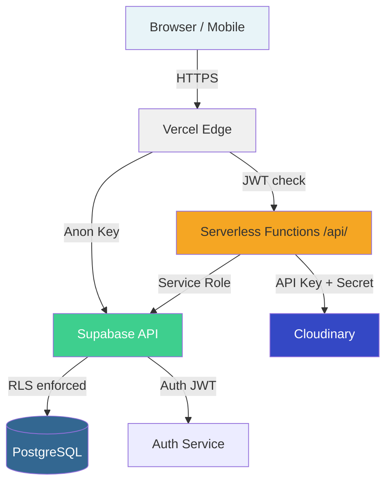
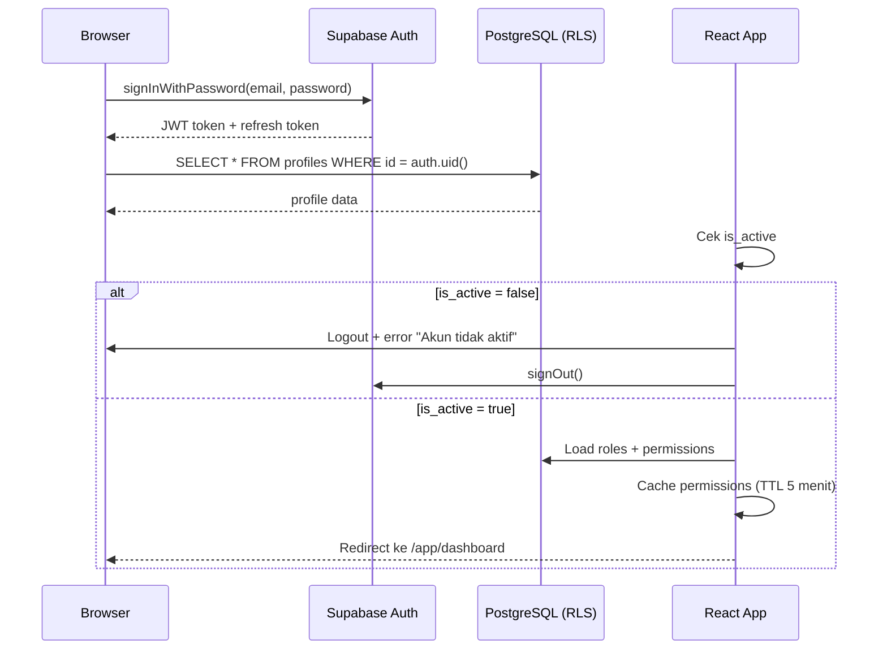
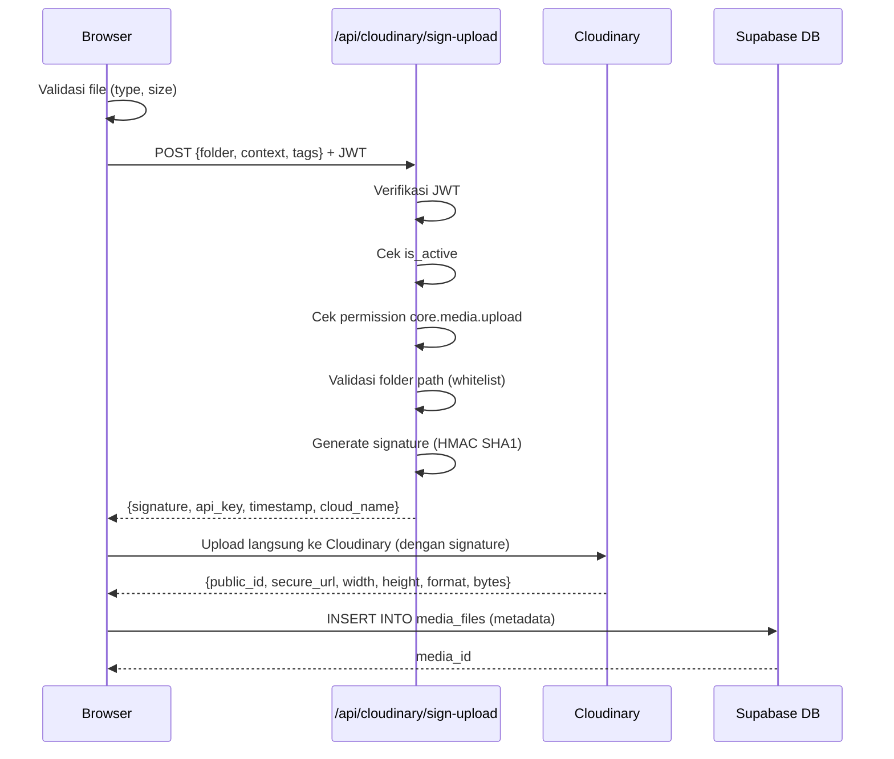

# SECURITY — GG PRODUCT OS

**Versi:** 1.0  
**Status:** Draft Arsitektur  
**Prinsip:** Defense in depth — RLS adalah lapisan utama, UI hanya lapisan tambahan

---

## 1. ARSITEKTUR KEAMANAN



**Lapisan keamanan (defense in depth):**
1. **HTTPS** — semua komunikasi terenkripsi
2. **Supabase Auth JWT** — setiap request membawa token
3. **Row Level Security (RLS)** — lapisan utama, tidak bisa dibypass dari client
4. **Serverless function validation** — validasi di server sebelum aksi kritis
5. **Frontend guard** — hanya lapisan UX, bukan keamanan sejati
6. **Audit log** — rekam seluruh aksi penting

---

## 2. AUTENTIKASI

### 2.1 Supabase Auth

- Provider: **email/password**
- Optional: **magic link** (future)
- Session: JWT disimpan oleh Supabase JS SDK
- Session refresh: otomatis via `supabase.auth.onAuthStateChange()`
- Logout: `supabase.auth.signOut()`
- Logout semua device: hanya Owner yang bisa memaksa logout user lain

### 2.2 Alur Login



### 2.3 Profile Activation

```sql
-- Trigger: setiap user baru dari auth.users, buat profile dengan is_active = false
CREATE OR REPLACE FUNCTION handle_new_user()
RETURNS TRIGGER AS $$
BEGIN
  INSERT INTO public.profiles (id, email, full_name, is_active)
  VALUES (
    NEW.id,
    NEW.email,
    COALESCE(NEW.raw_user_meta_data->>'full_name', ''),
    false  -- default inactive, Owner harus aktivasi manual
  );
  RETURN NEW;
END;
$$ LANGUAGE plpgsql SECURITY DEFINER;

CREATE TRIGGER on_auth_user_created
  AFTER INSERT ON auth.users
  FOR EACH ROW EXECUTE FUNCTION handle_new_user();
```

**Aturan aktivasi:**
- User baru otomatis `is_active = false`
- Owner harus mengaktifkan secara manual via `/settings/users`
- User yang di-deactivate kehilangan akses langsung (RLS menolak)
- Deactivation dicatat di `audit_logs`

### 2.4 Session Handling

```typescript
// src/core/auth/sessionManager.ts
const supabase = createClient(SUPABASE_URL, SUPABASE_ANON_KEY);

supabase.auth.onAuthStateChange(async (event, session) => {
  if (event === 'SIGNED_IN' && session) {
    await validateProfile(session.user.id);
  }
  if (event === 'SIGNED_OUT') {
    clearPermissionCache();
    redirectToLogin();
  }
  if (event === 'TOKEN_REFRESHED') {
    // Token diperbarui otomatis
  }
});

async function validateProfile(userId: string) {
  const { data: profile } = await supabase
    .from('profiles')
    .select('is_active')
    .eq('id', userId)
    .single();
  
  if (!profile?.is_active) {
    await supabase.auth.signOut();
    throw new Error('Akun tidak aktif. Hubungi administrator.');
  }
}
```

---

## 3. OTORISASI: ROLE DAN PERMISSION

### 3.1 Sistem Role

| Role Code | Nama | Deskripsi |
|---|---|---|
| `owner` | Owner / Super Admin | Akses penuh ke semua fitur |
| `product_lead` | Product Lead | Artikel, bahan, supplier, HPP |
| `production_lead` | Production Lead | Sampling, size chart, QC |
| `sourcing_admin` | Sourcing & Production Admin | Supplier, aksesori, dokumentasi |
| `creative` | Creative | Foto, desain, konten |
| `qc` | Quality Control | Checklist dan approval QC |
| `seller` | Seller | POS dan transaksi |
| `attendance_supervisor` | Attendance Supervisor | Jadwal dan koreksi kehadiran |
| `viewer` | Viewer | Read-only sesuai scope |

### 3.2 Permission Codes

**Core module:**
```
core.users.view          — melihat daftar pengguna
core.users.manage        — create/edit/deactivate pengguna
core.roles.view          — melihat daftar role
core.roles.manage        — assign/unassign role
core.permissions.manage  — kelola permission override
core.features.manage     — toggle feature flags
core.audit.view          — melihat audit logs
core.media.upload        — upload media
core.media.delete        — hapus media
```

**Launch module:**
```
launch.dashboard.view
launch.work_order.view_assigned   — melihat WO yang ditugaskan
launch.work_order.view_all        — melihat semua WO
launch.work_order.create
launch.work_order.edit
launch.work_order.assign
launch.work_order.cancel
launch.material.view
launch.material.manage
launch.supplier.view
launch.supplier.manage
launch.supplier.approve
launch.color.manage
launch.sample.view
launch.sample.manage
launch.sample.approve
launch.hpp.view
launch.hpp.manage
launch.hpp.finalize
launch.size_chart.view
launch.size_chart.manage
launch.size_chart.finalize
launch.qc.view
launch.qc.manage
launch.qc.approve
launch.article.review
launch.article.approve
launch.article.publish
launch.report.view
```

**Attendance module:**
```
attendance.self.view
attendance.self.checkin
attendance.self.checkout
attendance.self.request
attendance.team.view
attendance.schedule.manage
attendance.correction.manage
attendance.report.view
```

**POS module:**
```
pos.sell
pos.shift.open
pos.shift.close
pos.order.view_own
pos.order.view_all
pos.order.void
pos.payment.manage
pos.customer.manage
pos.report.view
```

### 3.3 Permission Matrix

| Permission | owner | product_lead | production_lead | sourcing_admin | creative | qc | seller | att_supervisor | viewer |
|---|:---:|:---:|:---:|:---:|:---:|:---:|:---:|:---:|:---:|
| core.users.view | ✅ | ✅ | — | — | — | — | — | — | — |
| core.users.manage | ✅ | — | — | — | — | — | — | — | — |
| core.roles.manage | ✅ | — | — | — | — | — | — | — | — |
| core.permissions.manage | ✅ | — | — | — | — | — | — | — | — |
| core.features.manage | ✅ | — | — | — | — | — | — | — | — |
| core.audit.view | ✅ | — | — | — | — | — | — | — | — |
| core.media.upload | ✅ | ✅ | ✅ | ✅ | ✅ | ✅ | — | — | — |
| launch.dashboard.view | ✅ | ✅ | ✅ | ✅ | ✅ | ✅ | — | — | ✅ |
| launch.work_order.view_all | ✅ | — | — | — | — | — | — | — | — |
| launch.work_order.view_assigned | ✅ | ✅ | ✅ | ✅ | ✅ | ✅ | — | — | ✅ |
| launch.work_order.create | ✅ | override* | — | — | — | — | — | — | — |
| launch.work_order.edit | ✅ | ✅ | — | — | — | — | — | — | — |
| launch.work_order.assign | ✅ | — | — | — | — | — | — | — | — |
| launch.work_order.cancel | ✅ | — | — | — | — | — | — | — | — |
| launch.material.view | ✅ | ✅ | ✅ | ✅ | ✅ | — | — | — | — |
| launch.material.manage | ✅ | ✅ | — | ✅ | — | — | — | — | — |
| launch.supplier.view | ✅ | ✅ | — | ✅ | — | — | — | — | — |
| launch.supplier.manage | ✅ | ✅ | — | ✅ | — | — | — | — | — |
| launch.supplier.approve | ✅ | ✅ | — | — | — | — | — | — | — |
| launch.color.manage | ✅ | ✅ | — | ✅ | ✅ | — | — | — | — |
| launch.sample.view | ✅ | ✅ | ✅ | ✅ | ✅ | ✅ | — | — | — |
| launch.sample.manage | ✅ | — | ✅ | — | ✅ | — | — | — | — |
| launch.sample.approve | ✅ | — | ✅ | — | — | ✅ | — | — | — |
| launch.hpp.view | ✅ | ✅ | — | — | — | — | — | — | — |
| launch.hpp.manage | ✅ | ✅ | — | — | — | — | — | — | — |
| launch.hpp.finalize | ✅ | ✅ | — | — | — | — | — | — | — |
| launch.size_chart.view | ✅ | ✅ | ✅ | — | — | ✅ | — | — | — |
| launch.size_chart.manage | ✅ | — | ✅ | — | — | — | — | — | — |
| launch.size_chart.finalize | ✅ | — | ✅ | — | — | — | — | — | — |
| launch.qc.view | ✅ | ✅ | ✅ | — | — | ✅ | — | — | — |
| launch.qc.manage | ✅ | — | ✅ | — | — | ✅ | — | — | — |
| launch.qc.approve | ✅ | — | — | — | — | ✅ | — | — | — |
| launch.article.approve | ✅ | — | — | — | — | — | — | — | — |
| launch.article.publish | ✅ | — | — | — | — | — | — | — | — |
| launch.report.view | ✅ | ✅ | ✅ | ✅ | — | — | — | — | — |
| pos.sell | ✅ | — | — | — | — | — | ✅ | — | — |
| pos.shift.open | ✅ | — | — | — | — | — | ✅ | — | — |
| pos.shift.close | ✅ | — | — | — | — | — | ✅ | — | — |
| pos.order.view_own | ✅ | — | — | — | — | — | ✅ | — | — |
| pos.order.view_all | ✅ | — | — | — | — | — | — | — | — |
| pos.order.void | ✅ | — | — | — | — | — | — | — | — |
| pos.report.view | ✅ | — | — | — | — | — | ✅ | — | — |
| attendance.self.* | ✅ | ✅ | ✅ | ✅ | ✅ | ✅ | ✅ | ✅ | ✅ |
| attendance.team.view | ✅ | — | — | — | — | — | — | ✅ | — |
| attendance.schedule.manage | ✅ | — | — | — | — | — | — | ✅ | — |
| attendance.correction.manage | ✅ | — | — | — | — | — | — | ✅ | — |
| attendance.report.view | ✅ | — | — | — | — | — | — | ✅ | — |

> *override = Product Lead dapat create work order hanya jika Owner memberikan `user_permission_overrides` dengan `launch.work_order.create = true`

### 3.4 Permission Resolver

```typescript
// src/core/permissions/permissionResolver.ts

interface PermissionContext {
  userId: string;
  rolePermissions: Map<string, boolean>;   // dari role
  overrides: Map<string, boolean>;          // user-specific override
  isActive: boolean;
  isOwner: boolean;
}

function hasPermission(
  ctx: PermissionContext,
  permissionCode: string
): boolean {
  // 1. Inactive user: semua ditolak
  if (!ctx.isActive) return false;

  // 2. Owner: semua diizinkan
  if (ctx.isOwner) return true;

  // 3. Cek user-specific override (lebih spesifik dari role)
  if (ctx.overrides.has(permissionCode)) {
    return ctx.overrides.get(permissionCode)!;
  }

  // 4. Cek role permission
  return ctx.rolePermissions.get(permissionCode) ?? false;
}

// Cache di memory dengan TTL 5 menit per user session
const permissionCache = new Map<string, { ctx: PermissionContext; expiry: number }>();

async function loadPermissionContext(userId: string): Promise<PermissionContext> {
  const cached = permissionCache.get(userId);
  if (cached && cached.expiry > Date.now()) {
    return cached.ctx;
  }

  const [profile, userRoles, overrides] = await Promise.all([
    supabase.from('profiles').select('is_active').eq('id', userId).single(),
    supabase.from('user_roles').select('role_id, roles(code, role_permissions(permission_id, is_allowed, permissions(code)))').eq('user_id', userId),
    supabase.from('user_permission_overrides').select('permission_id, is_allowed, permissions(code)').eq('user_id', userId),
  ]);

  // Build maps
  const rolePermissions = new Map<string, boolean>();
  userRoles.data?.forEach(ur => {
    ur.roles?.role_permissions?.forEach(rp => {
      if (rp.permissions?.code) {
        rolePermissions.set(rp.permissions.code, rp.is_allowed);
      }
    });
  });

  const overrideMap = new Map<string, boolean>();
  overrides.data?.forEach(o => {
    if (o.permissions?.code) {
      overrideMap.set(o.permissions.code, o.is_allowed);
    }
  });

  const isOwner = userRoles.data?.some(ur => ur.roles?.code === 'owner') ?? false;

  const ctx: PermissionContext = {
    userId,
    rolePermissions,
    overrides: overrideMap,
    isActive: profile.data?.is_active ?? false,
    isOwner,
  };

  permissionCache.set(userId, { ctx, expiry: Date.now() + 5 * 60 * 1000 });
  return ctx;
}
```

---

## 4. ROW LEVEL SECURITY (RLS)

RLS adalah **lapisan keamanan utama**. Semua tabel harus memiliki RLS enabled.

### 4.1 Helper Functions

```sql
-- Helper: apakah user adalah owner?
CREATE OR REPLACE FUNCTION is_owner()
RETURNS BOOLEAN AS $$
  SELECT EXISTS (
    SELECT 1 FROM user_roles ur
    JOIN roles r ON r.id = ur.role_id
    WHERE ur.user_id = auth.uid() AND r.code = 'owner'
  );
$$ LANGUAGE sql SECURITY DEFINER STABLE;

-- Helper: apakah user aktif?
CREATE OR REPLACE FUNCTION is_active_user()
RETURNS BOOLEAN AS $$
  SELECT COALESCE(
    (SELECT is_active FROM profiles WHERE id = auth.uid()),
    false
  );
$$ LANGUAGE sql SECURITY DEFINER STABLE;

-- Helper: apakah user memiliki permission tertentu?
CREATE OR REPLACE FUNCTION has_permission(permission_code TEXT)
RETURNS BOOLEAN AS $$
  SELECT (
    is_owner()
    OR EXISTS (
      SELECT 1 FROM user_permission_overrides upo
      JOIN permissions p ON p.id = upo.permission_id
      WHERE upo.user_id = auth.uid()
        AND p.code = permission_code
        AND upo.is_allowed = true
    )
    OR (
      NOT EXISTS (
        SELECT 1 FROM user_permission_overrides upo
        JOIN permissions p ON p.id = upo.permission_id
        WHERE upo.user_id = auth.uid()
          AND p.code = permission_code
          AND upo.is_allowed = false
      )
      AND EXISTS (
        SELECT 1 FROM user_roles ur
        JOIN role_permissions rp ON rp.role_id = ur.role_id
        JOIN permissions p ON p.id = rp.permission_id
        WHERE ur.user_id = auth.uid()
          AND p.code = permission_code
          AND rp.is_allowed = true
      )
    )
  );
$$ LANGUAGE sql SECURITY DEFINER STABLE;

-- Helper: apakah user adalah anggota work order?
CREATE OR REPLACE FUNCTION is_work_order_member(wo_id UUID)
RETURNS BOOLEAN AS $$
  SELECT EXISTS (
    SELECT 1 FROM launch_work_order_members
    WHERE work_order_id = wo_id AND user_id = auth.uid()
  );
$$ LANGUAGE sql SECURITY DEFINER STABLE;
```

### 4.2 RLS: Tabel `profiles`

```sql
ALTER TABLE profiles ENABLE ROW LEVEL SECURITY;

-- SELECT: user melihat profil sendiri, owner melihat semua
CREATE POLICY "profiles_select" ON profiles
  FOR SELECT USING (
    id = auth.uid() OR is_owner()
  );

-- UPDATE: user update profil sendiri (kecuali is_active), owner update semua
CREATE POLICY "profiles_update_self" ON profiles
  FOR UPDATE USING (id = auth.uid())
  WITH CHECK (
    id = auth.uid()
    -- Tidak boleh ubah is_active sendiri
    AND (is_active = (SELECT is_active FROM profiles WHERE id = auth.uid()))
  );

CREATE POLICY "profiles_update_owner" ON profiles
  FOR UPDATE USING (is_owner());

-- INSERT: hanya melalui trigger (handle_new_user), tidak dari client
-- Tidak perlu policy INSERT dari client
```

### 4.3 RLS: Tabel `launch_work_orders`

```sql
ALTER TABLE launch_work_orders ENABLE ROW LEVEL SECURITY;

-- SELECT: owner, creator, PIC, member, atau user dengan view_all
CREATE POLICY "work_orders_select" ON launch_work_orders
  FOR SELECT USING (
    is_active_user() AND (
      is_owner()
      OR created_by = auth.uid()
      OR primary_pic_user_id = auth.uid()
      OR is_work_order_member(id)
      OR has_permission('launch.work_order.view_all')
    )
  );

-- INSERT: hanya user dengan permission create
CREATE POLICY "work_orders_insert" ON launch_work_orders
  FOR INSERT WITH CHECK (
    is_active_user()
    AND has_permission('launch.work_order.create')
  );

-- UPDATE: PIC, creator, atau owner
CREATE POLICY "work_orders_update" ON launch_work_orders
  FOR UPDATE USING (
    is_active_user() AND (
      is_owner()
      OR primary_pic_user_id = auth.uid()
      OR (created_by = auth.uid() AND has_permission('launch.work_order.edit'))
    )
  );
```

### 4.4 RLS: Tabel `launch_hpp_versions`

```sql
ALTER TABLE launch_hpp_versions ENABLE ROW LEVEL SECURITY;

CREATE POLICY "hpp_select" ON launch_hpp_versions
  FOR SELECT USING (
    is_active_user() AND (
      is_owner() OR has_permission('launch.hpp.view')
      OR EXISTS (
        SELECT 1 FROM launch_work_orders wo
        WHERE wo.id = work_order_id
          AND (wo.primary_pic_user_id = auth.uid() OR wo.created_by = auth.uid())
      )
    )
  );

CREATE POLICY "hpp_insert" ON launch_hpp_versions
  FOR INSERT WITH CHECK (
    is_active_user() AND has_permission('launch.hpp.manage')
  );

-- UPDATE: hanya diizinkan jika status masih DRAFT
CREATE POLICY "hpp_update_draft_only" ON launch_hpp_versions
  FOR UPDATE USING (
    is_active_user()
    AND status = 'DRAFT'  -- FINAL tidak bisa diedit
    AND (is_owner() OR has_permission('launch.hpp.manage'))
  );

-- DELETE: tidak diizinkan
CREATE POLICY "hpp_no_delete" ON launch_hpp_versions
  FOR DELETE USING (false);
```

### 4.5 RLS: Tabel `audit_logs`

```sql
ALTER TABLE audit_logs ENABLE ROW LEVEL SECURITY;

-- SELECT: hanya owner dan user dengan core.audit.view
CREATE POLICY "audit_logs_select" ON audit_logs
  FOR SELECT USING (
    is_owner() OR has_permission('core.audit.view')
  );

-- INSERT: hanya via service function (SECURITY DEFINER)
-- Client tidak bisa INSERT langsung
CREATE POLICY "audit_logs_insert" ON audit_logs
  FOR INSERT WITH CHECK (false);  -- Semua INSERT melalui function

-- UPDATE/DELETE: tidak diizinkan sama sekali
CREATE POLICY "audit_logs_no_update" ON audit_logs
  FOR UPDATE USING (false);

CREATE POLICY "audit_logs_no_delete" ON audit_logs
  FOR DELETE USING (false);
```

### 4.6 RLS: Tabel `feature_flags`

```sql
ALTER TABLE feature_flags ENABLE ROW LEVEL SECURITY;

-- SELECT: semua user aktif bisa baca (untuk render menu)
CREATE POLICY "feature_flags_select" ON feature_flags
  FOR SELECT USING (is_active_user());

-- UPDATE: hanya owner
CREATE POLICY "feature_flags_update" ON feature_flags
  FOR UPDATE USING (is_owner());

-- INSERT/DELETE: hanya owner (flag baru atau hapus flag)
CREATE POLICY "feature_flags_insert" ON feature_flags
  FOR INSERT WITH CHECK (is_owner());
```

### 4.7 RLS: Tabel `catalog_products`

```sql
ALTER TABLE catalog_products ENABLE ROW LEVEL SECURITY;

-- SELECT: semua user aktif bisa lihat produk ACTIVE
CREATE POLICY "catalog_select_active" ON catalog_products
  FOR SELECT USING (
    is_active_user() AND (
      status = 'ACTIVE'
      OR is_owner()
      OR has_permission('launch.article.publish')
    )
  );

-- INSERT: hanya via publish flow dengan permission
CREATE POLICY "catalog_insert" ON catalog_products
  FOR INSERT WITH CHECK (
    is_active_user() AND has_permission('launch.article.publish')
  );

-- UPDATE: owner saja
CREATE POLICY "catalog_update" ON catalog_products
  FOR UPDATE USING (is_owner());
```

### 4.8 RLS: Tabel POS (scope seller)

```sql
ALTER TABLE pos_orders ENABLE ROW LEVEL SECURITY;

-- Seller hanya bisa lihat order sendiri
CREATE POLICY "pos_orders_select" ON pos_orders
  FOR SELECT USING (
    is_active_user() AND (
      seller_user_id = auth.uid()
      OR is_owner()
      OR has_permission('pos.order.view_all')
    )
  );

-- INSERT: hanya seller aktif
CREATE POLICY "pos_orders_insert" ON pos_orders
  FOR INSERT WITH CHECK (
    is_active_user() AND has_permission('pos.sell')
    AND seller_user_id = auth.uid()
  );
```

---

## 5. UPLOAD SECURITY

### 5.1 Alur Upload Aman



### 5.2 Validasi File di Frontend

```typescript
const ALLOWED_MIME_TYPES = [
  'image/jpeg',
  'image/jpg', 
  'image/png',
  'image/webp',
];
const MAX_FILE_SIZE = 10 * 1024 * 1024; // 10MB

function validateFile(file: File): { valid: boolean; error?: string } {
  if (!ALLOWED_MIME_TYPES.includes(file.type)) {
    return { valid: false, error: 'Format file tidak didukung. Gunakan JPEG, PNG, atau WebP.' };
  }
  if (file.size > MAX_FILE_SIZE) {
    return { valid: false, error: 'Ukuran file melebihi 10MB.' };
  }
  return { valid: true };
}
```

### 5.3 Serverless Function: sign-upload

```typescript
// api/cloudinary/sign-upload.ts
import { createClient } from '@supabase/supabase-js';
import { v2 as cloudinary } from 'cloudinary';

const ALLOWED_FOLDERS = [
  'gg-product-os/launch/',
  'gg-product-os/catalog/',
  'gg-product-os/profiles/',
  'gg-product-os/attendance/',
  'gg-product-os/pos/',
];

export default async function handler(req, res) {
  if (req.method !== 'POST') return res.status(405).end();

  // 1. Verifikasi JWT
  const authHeader = req.headers.authorization;
  if (!authHeader?.startsWith('Bearer ')) {
    return res.status(401).json({ error: 'Unauthorized' });
  }

  const supabase = createClient(
    process.env.VITE_SUPABASE_URL!,
    process.env.SUPABASE_SERVICE_ROLE_KEY!
  );

  const { data: { user }, error } = await supabase.auth.getUser(
    authHeader.replace('Bearer ', '')
  );

  if (error || !user) {
    return res.status(401).json({ error: 'Invalid token' });
  }

  // 2. Cek is_active
  const { data: profile } = await supabase
    .from('profiles')
    .select('is_active')
    .eq('id', user.id)
    .single();

  if (!profile?.is_active) {
    return res.status(403).json({ error: 'Akun tidak aktif' });
  }

  // 3. Validasi folder (whitelist)
  const { folder } = req.body;
  const isAllowed = ALLOWED_FOLDERS.some(f => folder?.startsWith(f));
  if (!isAllowed) {
    return res.status(422).json({ error: 'Folder tidak valid' });
  }

  // 4. Generate signature
  const timestamp = Math.round(new Date().getTime() / 1000);
  const params = {
    folder,
    timestamp,
    ...req.body.context ? { context: req.body.context } : {},
  };

  const signature = cloudinary.utils.api_sign_request(
    params,
    process.env.CLOUDINARY_API_SECRET!
  );

  return res.status(200).json({
    signature,
    api_key: process.env.CLOUDINARY_API_KEY!,
    timestamp,
    cloud_name: process.env.VITE_CLOUDINARY_CLOUD_NAME!,
    folder,
  });
}
```

---

## 6. INPUT SANITATION DAN VALIDASI

### 6.1 Validasi dengan Zod

Semua form menggunakan Zod schema. Validasi dijalankan di:
1. **Client-side**: untuk UX (pesan error real-time)
2. **Server-side**: di serverless function sebelum insert ke DB
3. **Database**: constraint dan check di PostgreSQL

```typescript
// Contoh schema work order
const workOrderSchema = z.object({
  brand_id: z.string().uuid('Brand harus dipilih'),
  article_code: z.string()
    .min(3, 'Kode artikel minimal 3 karakter')
    .max(50, 'Kode artikel maksimal 50 karakter')
    .regex(/^[A-Z0-9-]+$/, 'Kode artikel hanya huruf kapital, angka, dan tanda -'),
  article_name: z.string().min(3).max(200),
  category: z.enum(['TOPS', 'BOTTOMS', 'OUTERWEAR', 'DRESS', 'ACCESSORIES', 'OTHER']),
  description: z.string().min(10).max(2000),
  primary_pic_user_id: z.string().uuid('PIC harus dipilih'),
  target_date: z.string().date().optional(),
  priority: z.enum(['LOW', 'NORMAL', 'HIGH', 'URGENT']).default('NORMAL'),
  reference_url: z.string().url().optional().or(z.literal('')),
});
```

### 6.2 Aturan Sanitation

- Semua string di-trim sebelum disimpan
- URL divalidasi format (harus `https://`)
- Angka HPP: divalidasi non-negatif
- Tanggal: validasi format ISO 8601
- HTML entities di-escape di UI
- File upload: validasi sebelum request signature

---

## 7. PERLINDUNGAN PRIVILEGE ESCALATION

1. **Non-owner tidak bisa assign role ke diri sendiri**
   - RLS: INSERT ke `user_roles` hanya diizinkan Owner
   - Service layer: validasi bahwa actor adalah Owner

2. **Permission override dicatat**
   - Setiap INSERT ke `user_permission_overrides` → audit log
   - `granted_by` wajib diisi dengan actor user_id

3. **Owner override juga dicatat**
   - Setiap tindakan Owner yang override normal flow → audit log dengan `action: 'OWNER_OVERRIDE'`

4. **`is_system` role tidak bisa dihapus**
   ```sql
   CREATE POLICY "roles_no_delete_system" ON roles
     FOR DELETE USING (NOT is_system);
   ```

5. **User tidak bisa deactivate dirinya sendiri**
   ```sql
   -- Di RLS update profiles: is_active hanya bisa diubah oleh Owner
   CREATE POLICY "profiles_deactivate" ON profiles
     FOR UPDATE USING (
       -- Self: tidak bisa ubah is_active
       (id = auth.uid() AND is_active = (SELECT is_active FROM profiles WHERE id = auth.uid()))
       -- Owner: bisa ubah is_active siapa saja kecuali dirinya sendiri
       OR (is_owner() AND id != auth.uid())
     );
   ```

---

## 8. RATE LIMITING

| Endpoint | Limit | Window | Metode |
|---|---|---|---|
| `/api/auth/login` | 10 request | 1 menit per IP | Supabase Auth built-in |
| `/api/cloudinary/sign-upload` | 20 request | 1 menit per user | Vercel rate limiting |
| `/api/cloudinary/delete` | 10 request | 1 menit per user | Vercel rate limiting |
| Semua API | 100 request | 1 menit per IP | Vercel Edge |

---

## 9. ATURAN SECRET

| Secret | Lokasi yang DILARANG | Lokasi yang BENAR |
|---|---|---|
| `SUPABASE_SERVICE_ROLE_KEY` | Browser, frontend bundle | Vercel env (server-only) |
| `CLOUDINARY_API_SECRET` | Browser, frontend bundle | Vercel env (server-only) |
| `CLOUDINARY_API_KEY` | Browser | Vercel env → dikembalikan ke client dalam response sign-upload (bukan secret) |
| `DATABASE_PASSWORD` | Mana pun di kode | Supabase dashboard saja |

**Pemeriksaan secret:**
```bash
# Jalankan setelah build untuk memastikan tidak ada secret yang bocor
grep -r "SERVICE_ROLE_KEY\|API_SECRET\|DB_PASS" dist/
```

---

## 10. DATA SCOPE PER USER

| Role | Scope data yang terlihat |
|---|---|
| Owner | Semua data, semua module |
| Product Lead | WO yang di-assign + milik sendiri; HPP WO yang ditugaskan |
| Production Lead | WO yang di-assign; sample, size chart, QC yang ditugaskan |
| Sourcing Admin | WO yang di-assign; supplier dan material yang ditugaskan |
| Creative | WO yang di-assign; media yang di-upload |
| QC | WO yang di-assign; QC results |
| Seller | Order sendiri; catalog products ACTIVE |
| Att. Supervisor | Attendance records tim yang dikelola |
| Viewer | WO yang di-assign (read-only) |

---

*Akhir dokumen security.md*
