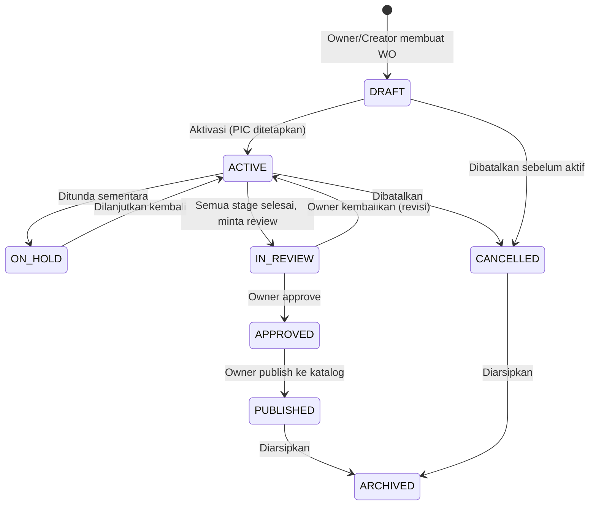
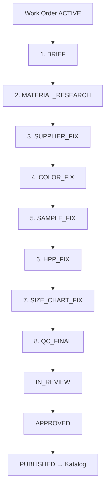
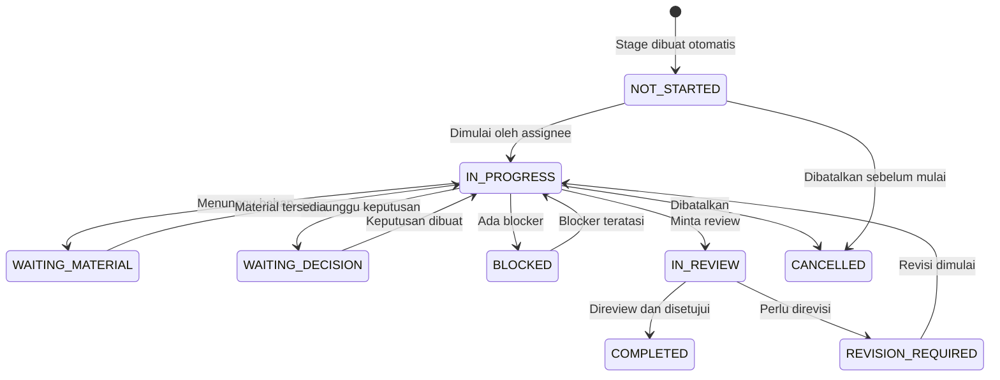
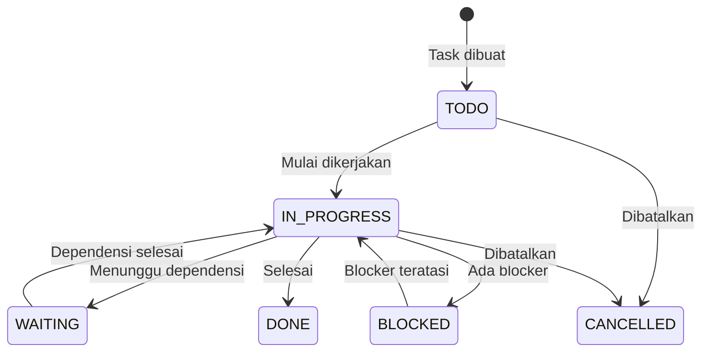
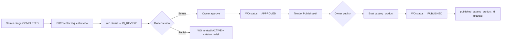
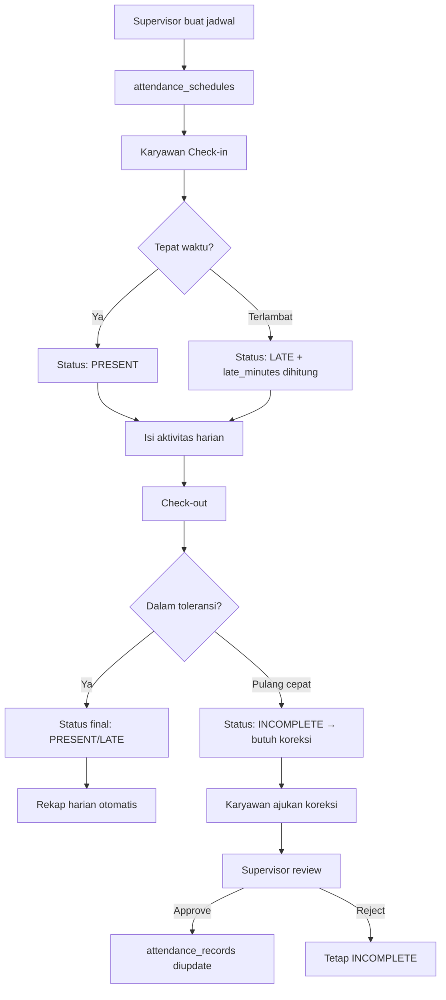
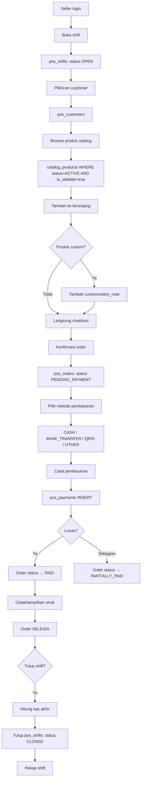

# WORKFLOWS — GG PRODUCT OS

**Versi:** 1.0  
**Status:** Draft Arsitektur  
**Berlaku untuk:** GG Supply dan GUDSKUY  

---

## 1. GAMBARAN UMUM WORKFLOW

GG Product OS mengorkestrasi tiga alur utama:

1. **Product Launch** — workflow utama, aktif dari awal
2. **Attendance** — disiapkan, feature flag OFF
3. **POS Seller** — disiapkan, feature flag OFF

Seluruh monitoring menggunakan **satu sumber data** yang sama dengan eksekusi. Tidak ada tabel monitoring kedua.

---

## 2. WORKFLOW PRODUCT LAUNCH

### 2.1 Status Work Order



| Status | Deskripsi | Siapa yang dapat mengubah |
|---|---|---|
| `DRAFT` | Work order baru dibuat, belum aktif | Creator, Owner |
| `ACTIVE` | Sedang dikerjakan, stage berjalan | Owner, PIC |
| `ON_HOLD` | Ditunda sementara karena blocker eksternal | Owner, PIC |
| `IN_REVIEW` | Semua stage selesai, menunggu review Owner | Owner |
| `APPROVED` | Owner sudah menyetujui artikel | Owner saja |
| `PUBLISHED` | Artikel dipublikasikan ke katalog internal | Owner saja |
| `CANCELLED` | Dibatalkan dengan alasan tercatat | Owner |
| `ARCHIVED` | Diarsipkan (setelah published atau cancelled) | Owner |

### 2.2 Delapan Tahap Artikel



Stage berjalan **secara berurutan**. Stage berikutnya hanya bisa dimulai setelah stage sebelumnya `COMPLETED`.

Owner dapat melakukan override untuk skip atau memaksa completion, dan setiap override tercatat di `audit_logs`.

### 2.3 Status Stage Run



---

## 3. DETAIL SETIAP TAHAP

### 3.1 Tahap 1 — Brief Artikel (`BRIEF`)

**Tujuan:** Mendefinisikan artikel, menetapkan PIC, dan mengaktifkan work order.

**Data wajib (Completion Gate):**
- `brand_id` — brand GG Supply atau GUDSKUY
- `article_code` — kode unik artikel
- `article_name` — nama produk
- `category` — kategori produk
- `product_type` — tipe produk
- `purpose` — tujuan produk
- `target_market` — target pasar
- `primary_pic_user_id` — PIC ditetapkan
- `description` — deskripsi minimal

**Data opsional:**
- `target_date` — target penyelesaian
- `priority` — NORMAL / HIGH / URGENT
- `reference_url` — link referensi
- `hero_media_id` — foto referensi utama
- `custom_capability` — apakah dapat dikustom

**Siapa yang dapat mengisi:**
- Owner: semua field
- Product Lead: semua field jika memiliki `launch.work_order.create`
- PIC yang ditugaskan: edit field non-kritis

**Completion Gate:**
```
brand_id IS NOT NULL
AND article_code IS NOT NULL AND article_code != ''
AND article_name IS NOT NULL AND article_name != ''
AND category IS NOT NULL
AND primary_pic_user_id IS NOT NULL
AND description IS NOT NULL AND length(description) >= 10
```

**Output:** Work order status berubah ke `ACTIVE`, seluruh 8 stage run dibuat otomatis dengan status `NOT_STARTED`.

---

### 3.2 Tahap 2 — Riset Bahan (`MATERIAL_RESEARCH`)

**Tujuan:** Mengidentifikasi dan memilih bahan yang sesuai untuk artikel.

**Data wajib:**
- Minimal 1 `launch_material_candidates` dengan status `SELECTED`

**Data per material candidate:**
- `material_name` — nama bahan
- `composition` — komposisi (mis. 100% Cotton, 60% Cotton 40% Polyester)
- `gsm` — gramasi (g/m²)
- `width_cm` — lebar kain dalam cm
- `unit` — satuan (meter, yard)
- `estimated_consumption` — estimasi konsumsi per pcs
- `characteristics` — karakter bahan
- `suitability_reason` — alasan cocok
- `risks` — risiko penggunaan
- `status` — CANDIDATE / SELECTED / REJECTED
- `swatch_media_id` — foto swatch bahan

**Siapa yang dapat mengisi:**
- Product Lead (Dodi): create, edit, finalize
- Sourcing Admin (Syaikhu): create, edit
- Owner: semua

**Completion Gate:**
```
EXISTS (
  SELECT 1 FROM launch_material_candidates
  WHERE work_order_id = :id AND status = 'SELECTED'
)
```

---

### 3.3 Tahap 3 — Fix Supplier (`SUPPLIER_FIX`)

**Tujuan:** Menentukan supplier final dengan quotation yang disetujui.

**Data wajib:**
- Minimal 1 `launch_supplier_quotes` dengan status `APPROVED` untuk work order ini

**Data per supplier:**
- `supplier_name`, `supplier_code`, `category`
- `contact_name`, `phone`, `email`, `address`

**Data per quote:**
- `item_name` — nama item yang dikutip
- `price` — harga satuan
- `currency` — IDR / USD
- `price_unit` — satuan harga (per meter, per pcs)
- `moq` — minimum order quantity
- `lead_time_days` — estimasi waktu kirim
- `available_colors` — warna yang tersedia
- `valid_until` — batas berlaku quotation
- `status` — PENDING / APPROVED / REJECTED

**Siapa yang dapat mengisi:**
- Sourcing Admin (Syaikhu): create supplier, submit quote
- Product Lead (Dodi): approve quote
- Owner: approve quote, lihat semua

**Completion Gate:**
```
EXISTS (
  SELECT 1 FROM launch_supplier_quotes
  WHERE work_order_id = :id AND status = 'APPROVED'
)
```

---

### 3.4 Tahap 4 — Fix Warna (`COLOR_FIX`)

**Tujuan:** Menetapkan palet warna final untuk artikel.

**Data wajib:**
- Minimal 1 `launch_article_colors` dengan `is_final = true`

**Data per warna:**
- `color_name` — nama warna
- `internal_color_code` — kode internal
- `supplier_color_code` — kode dari supplier
- `panel_scope` — panel yang menggunakan warna ini
- `hex_reference` — referensi hex (opsional)
- `swatch_media_id` — foto swatch fisik
- `is_final` — apakah warna sudah final
- `approved_by`, `approved_at`

**Siapa yang dapat mengisi:**
- Sourcing Admin (Syaikhu): create warna
- Product Lead (Dodi): finalize
- Owner: approve dan finalize

**Completion Gate:**
```
EXISTS (
  SELECT 1 FROM launch_article_colors
  WHERE work_order_id = :id AND is_final = true
)
```

---

### 3.5 Tahap 5 — Fix Sampel (`SAMPLE_FIX`)

**Tujuan:** Mengembangkan sampel fisik dan menetapkan master sample.

**Versioning:** Setiap iterasi sampel membuat record baru. Revisi membuat versi baru dengan `parent_sample_id` menunjuk ke versi sebelumnya.

**Data per sampel:**
- `version_no` — nomor versi (1, 2, 3, ...)
- `sample_code` — kode sampel (mis. GSP-001-S01)
- `parent_sample_id` — referensi ke versi sebelumnya
- `status` — DRAFT / REVISION / APPROVED / MASTER
- `sample_date` — tanggal sampling
- `material_summary` — ringkasan bahan yang digunakan
- `pattern_summary` — ringkasan pola
- `construction_summary` — ringkasan konstruksi
- `result_summary` — hasil evaluasi
- `revision_notes` — catatan revisi (jika revision)
- `is_master_sample` — apakah ini master sample
- `approved_by`, `approved_at`

**Aturan:**
- Hanya 1 sampel yang boleh berstatus `MASTER` per work order
- Sampel `MASTER` tidak dapat diedit
- Foto sampel disimpan sebagai media di Cloudinary folder `samples/v{n}/`

**Siapa yang dapat mengisi:**
- Production Lead (Yadi): create, update, approve
- QC: review measurement
- Owner: approve master

**Completion Gate:**
```
EXISTS (
  SELECT 1 FROM launch_samples
  WHERE work_order_id = :id AND is_master_sample = true AND status = 'MASTER'
)
```

---

### 3.6 Tahap 6 — Fix HPP (`HPP_FIX`)

**Tujuan:** Menghitung dan memfinalisasi Harga Pokok Produksi.

**Formula HPP:**
```
direct_cost_total   = SUM(hpp_items.total_cost)
reject_cost_total   = direct_cost_total × reject_pct / 100
overhead_cost_total = (direct_cost_total + reject_cost_total) × overhead_pct / 100
hpp_total           = direct_cost_total + reject_cost_total + overhead_cost_total
suggested_selling_price = hpp_total / (1 - target_margin_pct / 100)
```

**Kategori HPP item:**
`FABRIC` · `LINING` · `ACCESSORY` · `CUTTING` · `SEWING` · `PRINTING` · `EMBROIDERY` · `LABEL` · `PACKAGING` · `FINISHING` · `QUALITY_CONTROL` · `TRANSPORT` · `OTHER`

**Versioning HPP:**
- Revisi selalu membuat `version_no` baru
- Versi lama dengan status `FINAL` tidak dapat diubah
- Hanya 1 versi yang berstatus `FINAL` aktif per work order

**Aturan validasi:**
- Semua biaya ≥ 0
- `reject_pct` antara 0–100%
- `overhead_pct` antara 0–100%
- `target_margin_pct` antara 0–99%
- Kalkulasi dilakukan di service layer; nilai dari client tidak dipercaya

**Siapa yang dapat mengisi:**
- Product Lead (Dodi): create, manage, finalize
- Owner: view all, finalize

**Completion Gate:**
```
EXISTS (
  SELECT 1 FROM launch_hpp_versions
  WHERE work_order_id = :id AND status = 'FINAL'
)
```

---

### 3.7 Tahap 7 — Fix Size Chart (`SIZE_CHART_FIX`)

**Tujuan:** Menetapkan standar ukuran final untuk artikel.

**Struktur size chart:**
- `launch_size_chart_versions` → versi chart
- `launch_size_chart_sizes` → kolom ukuran (S, M, L, XL, XXL, dst)
- `launch_measurement_points` → baris titik ukur (lingkar dada, panjang badan, dll)
- `launch_size_chart_values` → nilai per (ukuran × titik ukur) dengan toleransi

**Versioning:**
- Setiap revisi membuat versi baru
- Versi `FINAL` tidak dapat diubah
- Size chart dapat di-copy dari hasil pengukuran sampel

**Siapa yang dapat mengisi:**
- Production Lead (Yadi): create, manage, finalize
- Owner: view, finalize

**Completion Gate:**
```
EXISTS (
  SELECT 1 FROM launch_size_chart_versions
  WHERE work_order_id = :id AND status = 'FINAL'
)
```

---

### 3.8 Tahap 8 — QC dan Artikel Final (`QC_FINAL`)

**Tujuan:** Melakukan quality control final dan mendapatkan persetujuan Owner.

**Proses QC:**
1. Pilih `launch_qc_templates` yang sesuai dengan kategori artikel
2. Isi setiap `launch_qc_template_items` dengan result: `PASS` / `FAIL` / `NA`
3. Item `is_required = true` harus semua `PASS`
4. Item `is_required = false` boleh `FAIL` tanpa memblock completion

**Siapa yang mengisi:**
- Production Lead (Yadi): isi checklist teknis
- QC role: isi checklist QC
- Owner: final approval artikel

**Completion Gate:**
```
-- Semua required QC items harus PASS
NOT EXISTS (
  SELECT 1 
  FROM launch_qc_results qr
  JOIN launch_qc_template_items ti ON ti.id = qr.template_item_id
  WHERE qr.work_order_id = :id
    AND ti.is_required = true
    AND qr.result != 'PASS'
)
AND overall_status = 'APPROVED'  -- Owner sudah approve
```

---

## 4. STATUS TASK



**Subtask:**
Setiap stage dapat memiliki banyak task. Task dapat memiliki `dependency_task_id` sehingga task tertentu hanya bisa dimulai setelah task lain selesai.

**Field task:**
```
title, description, assigned_user_id, priority (LOW/NORMAL/HIGH/URGENT),
status, due_date, dependency_task_id, completed_at, completed_by,
created_by, created_at, updated_at
```

---

## 5. REVISI DAN BLOCKER

### 5.1 Revisi Stage

Ketika reviewer meminta revisi:
1. Status stage berubah dari `IN_REVIEW` → `REVISION_REQUIRED`
2. Field `revision_reason` diisi dengan catatan revisi
3. Record baru dibuat di `launch_stage_updates` (from: IN_REVIEW, to: REVISION_REQUIRED)
4. Audit log dicatat
5. Notifikasi dikirim ke assignee stage
6. Assignee memulai revisi → status kembali ke `IN_PROGRESS`

### 5.2 Blocker Stage

Ketika terjadi blocker:
1. Status stage berubah ke `BLOCKED`
2. Field `blocked_reason` wajib diisi
3. Record baru di `launch_stage_updates`
4. Audit log dicatat
5. Owner mendapat notifikasi
6. Ketika blocker teratasi → status kembali ke `IN_PROGRESS`, `blocked_reason` di-clear

### 5.3 Owner Override

Owner dapat:
- Skip stage yang belum selesai
- Force-complete stage tanpa completion gate terpenuhi
- Setiap override **wajib dicatat** di `audit_logs` dengan:
  - `action: 'OWNER_OVERRIDE'`
  - `before_data`: kondisi sebelum override
  - `after_data`: kondisi sesudah override
  - `actor_user_id`: ID Owner

---

## 6. APPROVAL OWNER DAN PUBLISH

### 6.1 Alur Approval



### 6.2 Publish ke Katalog

**Proses publish (idempotent):**
```
1. Cek: apakah work_order.published_catalog_product_id sudah ada?
   → Jika ya: hentikan, return existing catalog_product_id
   → Jika tidak: lanjutkan

2. Validasi payload:
   - article_code tidak duplikat di catalog_products
   - ada minimal 1 warna final
   - ada HPP final (untuk mengisi cost_price)
   - ada size chart final

3. Buat catalog_product dalam transaction:
   INSERT INTO catalog_products (source_work_order_id, ...)
   INSERT INTO catalog_product_colors (...)
   INSERT INTO catalog_product_sizes (...)
   INSERT INTO catalog_product_variants (...)

4. Update work_order:
   published_catalog_product_id = new_catalog_product_id
   overall_status = 'PUBLISHED'

5. Catat audit log
```

**Pencegahan publish ganda:**
- `catalog_products.source_work_order_id` memiliki `UNIQUE` constraint
- Service layer cek `published_catalog_product_id` sebelum memulai
- Publish menggunakan database transaction untuk atomicity

---

## 7. MONITORING: KELOLA & PANTAU

**Prinsip:** Kelola & Pantau dan Perintah Kerja menggunakan **sumber data yang sama**.

```
launch_work_orders
  + launch_stage_runs
  + launch_tasks
  + launch_work_order_members
  + launch_stage_updates (aktivitas terbaru)
= View monitoring
```

**Tidak ada tabel monitoring kedua.** Perbedaannya hanya pada query filter dan tampilan UI:

| | Perintah Kerja | Kelola & Pantau |
|---|---|---|
| **Scope data** | WO yang ditugaskan ke user | Semua WO (view_all) |
| **Tujuan** | Eksekusi tugas | Oversight Owner |
| **Filter default** | Assigned to me | Semua brand, semua PIC |
| **Sort default** | Due date | Overdue first |
| **Aksi utama** | Update status, tambah note | Intervensi, reassign |

**Indikator yang ditampilkan di Kelola & Pantau:**
- Artikel overdue (target_date < today)
- Stage blocked (status = BLOCKED)
- Stage idle (tidak ada update > N hari)
- Waiting review (status = IN_REVIEW)
- HPP belum final
- Sampel terlalu banyak revisi (version_no > 3)
- Supplier belum fix
- Artikel tanpa update > 7 hari
- Kesiapan per brand (% artikel yang published)

---

## 8. AUDIT TRAIL

Setiap kejadian berikut wajib dicatat ke `audit_logs`:

| Event | `action` | `entity_type` |
|---|---|---|
| Work order dibuat | `CREATE` | `work_order` |
| Status work order berubah | `STATUS_CHANGE` | `work_order` |
| Stage status berubah | `STATUS_CHANGE` | `stage_run` |
| Task dibuat/diubah | `CREATE` / `UPDATE` | `task` |
| Material candidate ditambah | `CREATE` | `material_candidate` |
| Supplier quote diapprove | `APPROVE` | `supplier_quote` |
| Warna difinalize | `FINALIZE` | `article_color` |
| Sample diapprove/menjadi master | `APPROVE` / `SET_MASTER` | `sample` |
| HPP difinalisasi | `FINALIZE` | `hpp_version` |
| Size chart difinalisasi | `FINALIZE` | `size_chart_version` |
| QC template diisi | `SUBMIT` | `qc_result` |
| Artikel diapprove oleh Owner | `APPROVE` | `work_order` |
| Artikel dipublish ke katalog | `PUBLISH` | `work_order` |
| Owner override | `OWNER_OVERRIDE` | `stage_run` |
| Permission diubah | `UPDATE` | `user_permission` |

Format audit log:
```json
{
  "id": "uuid",
  "module": "launch",
  "entity_type": "work_order",
  "entity_id": "uuid-work-order",
  "action": "STATUS_CHANGE",
  "before_data": { "overall_status": "ACTIVE" },
  "after_data": { "overall_status": "IN_REVIEW" },
  "actor_user_id": "uuid-user",
  "created_at": "2026-07-25T07:00:00Z",
  "request_id": "req-uuid"
}
```

`audit_logs` adalah **append-only**: tidak ada UPDATE atau DELETE yang diizinkan dari client.

---

## 9. WORKFLOW ATTENDANCE

> **Status:** Feature flag `FEATURE_ATTENDANCE=false`. Workflow ini disiapkan tetapi belum diaktifkan.



**Status attendance:**
- `PRESENT` — hadir tepat waktu
- `LATE` — hadir terlambat melebihi toleransi
- `PERMISSION` — izin (disetujui)
- `SICK` — sakit (dengan bukti)
- `ABSENT` — tidak hadir tanpa keterangan
- `HOLIDAY` — hari libur
- `OFF` — hari off sesuai jadwal
- `INCOMPLETE` — check-in ada tapi check-out belum / ada masalah

**Aturan attendance:**
- Tidak bisa check-out sebelum check-in
- Tidak bisa check-in dua kali pada hari yang sama
- Koreksi membutuhkan persetujuan Supervisor
- Supervisor tidak bisa approve koreksi sendiri kecuali Owner override

---

## 10. WORKFLOW POS SELLER

> **Status:** Feature flag `FEATURE_POS_SELLER=false`. Workflow ini disiapkan tetapi belum diaktifkan.



**Aturan POS:**
- Produk hanya muncul jika `catalog_products.status = 'ACTIVE'` dan `is_sellable = true`
- Produk yang masih dalam tahap sampling tidak dapat dijual
- Seller hanya melihat order sendiri kecuali memiliki `pos.order.view_all`
- Void order membutuhkan permission `pos.order.void`
- Transaksi tidak pernah dihapus — hanya di-void
- Data produk di `pos_order_items` menggunakan **snapshot** saat transaksi dibuat
- Snapshot penting agar histori transaksi tidak berubah jika nama produk diubah kemudian

**Status order:**
- `DRAFT` → `PENDING_PAYMENT` → `PAID`
- Atau `PENDING_PAYMENT` → `PARTIALLY_PAID` → `PAID`
- Atau `PENDING_PAYMENT` → `CANCELLED` / `VOID` / `REFUNDED`

---

## 11. COMPLETION GATE SUMMARY

| Tahap | Gate Minimal |
|---|---|
| Brief | brand + article_code + article_name + category + PIC ditetapkan |
| Riset Bahan | ≥1 material candidate berstatus SELECTED |
| Fix Supplier | ≥1 supplier quote berstatus APPROVED |
| Fix Warna | ≥1 warna dengan is_final=true |
| Fix Sampel | ≥1 sample dengan is_master_sample=true dan status=MASTER |
| Fix HPP | ≥1 hpp_version dengan status=FINAL |
| Fix Size Chart | ≥1 size_chart_version dengan status=FINAL |
| QC Final | Semua required QC items=PASS DAN overall_status=APPROVED |

---

## 12. LARANGAN WORKFLOW

1. Jangan membuat tabel monitoring kedua — gunakan query dari tabel yang sama
2. Jangan skip stage tanpa Owner override yang tercatat
3. Jangan edit record HPP, size chart, atau sample yang sudah FINAL/MASTER
4. Revisi selalu membuat versi baru, bukan menimpa yang lama
5. Jangan publish artikel yang belum APPROVED
6. Jangan publish jika `published_catalog_product_id` sudah terisi
7. Jangan izinkan POS menjual produk yang belum PUBLISHED ke katalog
8. Jangan hapus audit_logs — append only

---

*Akhir dokumen workflows.md*
